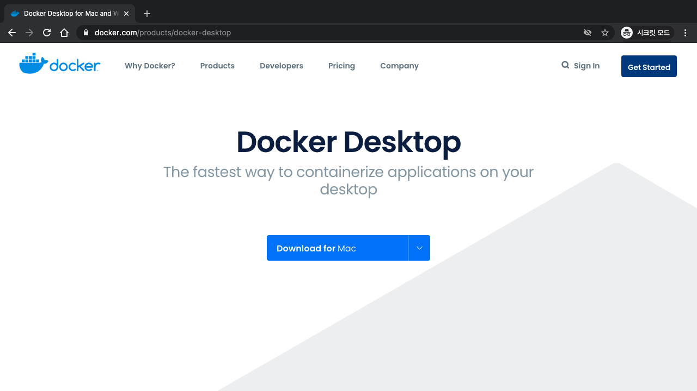
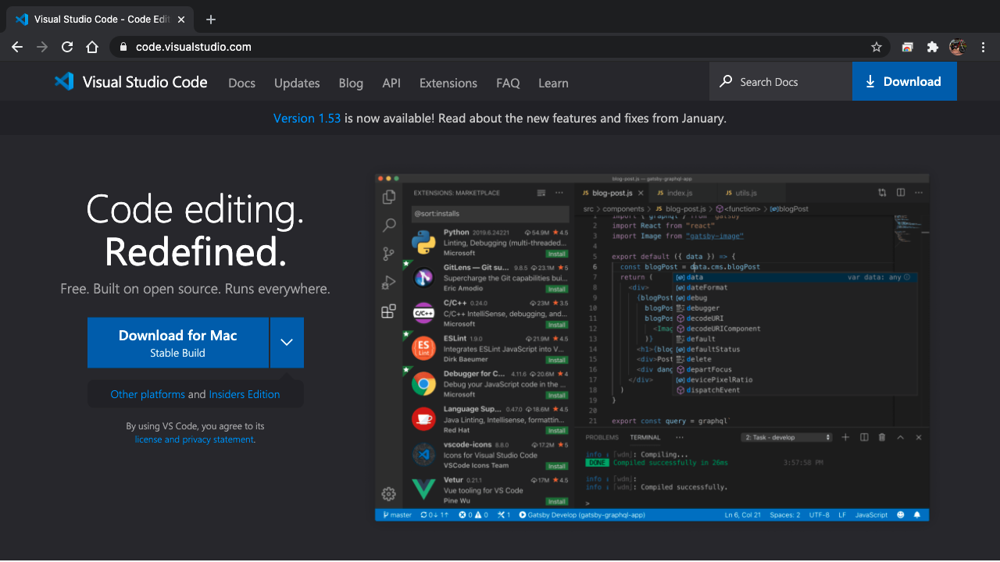
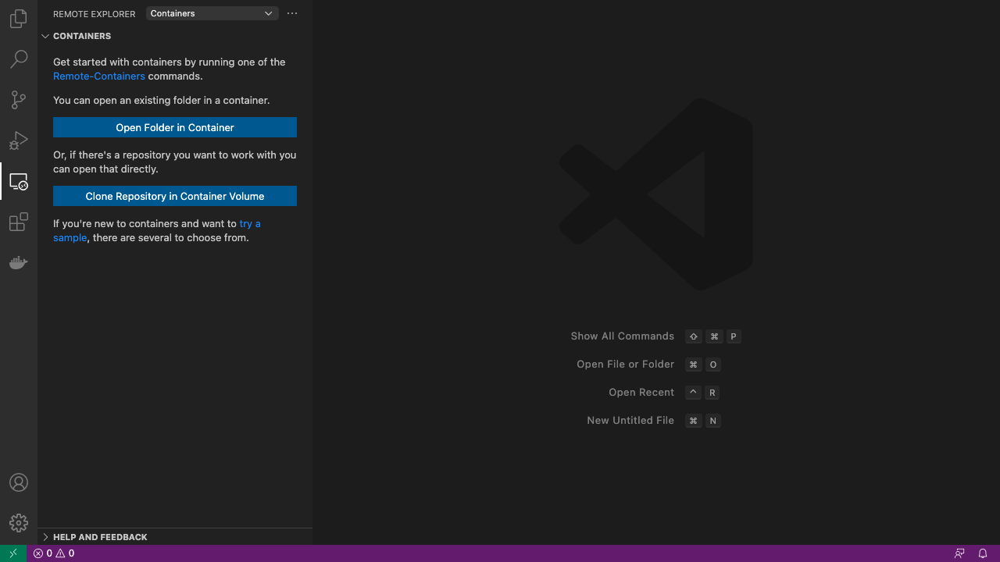
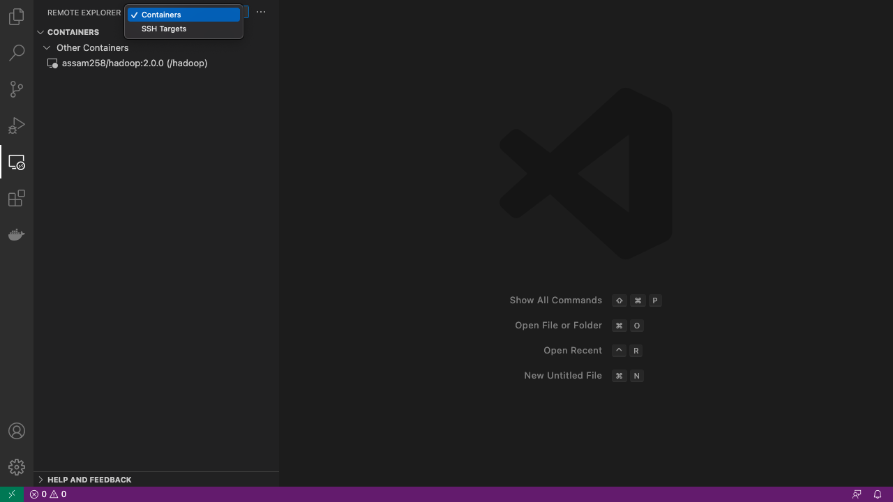
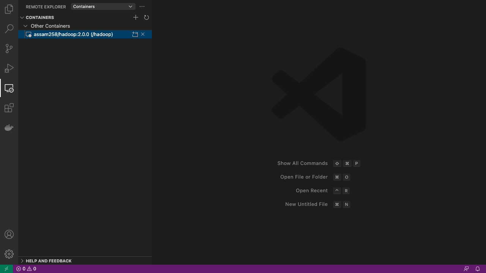
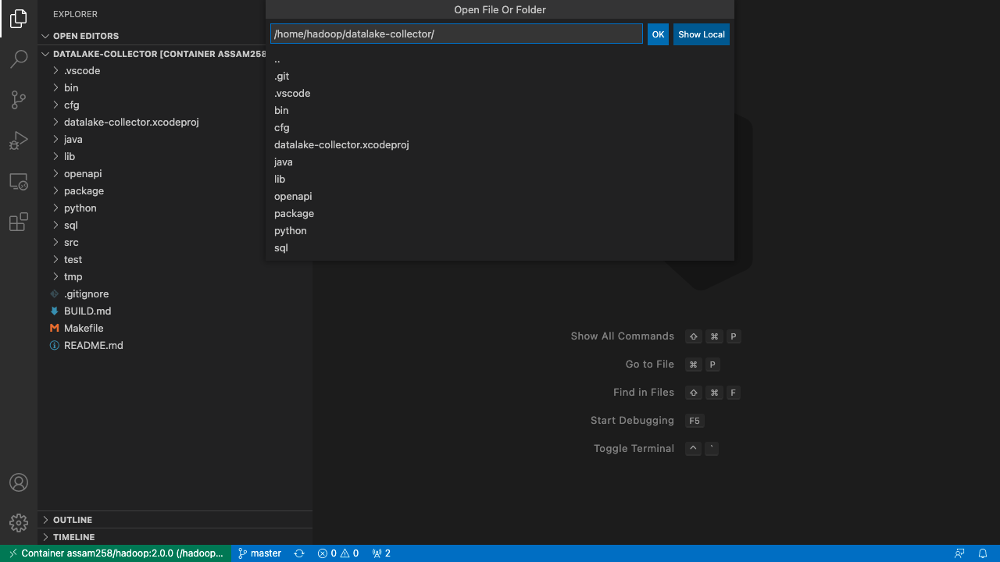
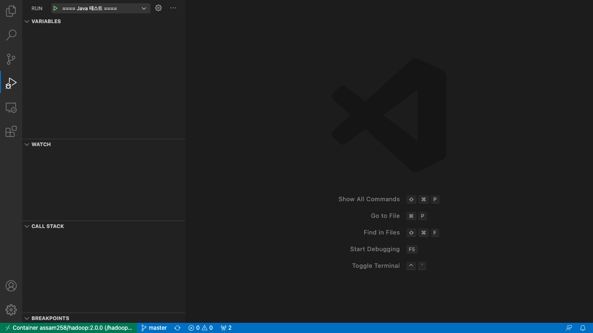
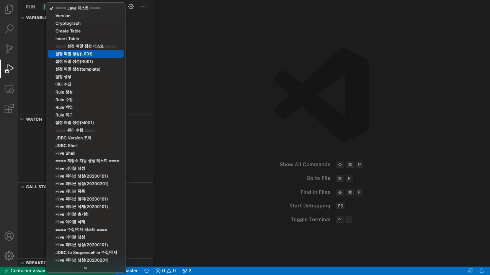
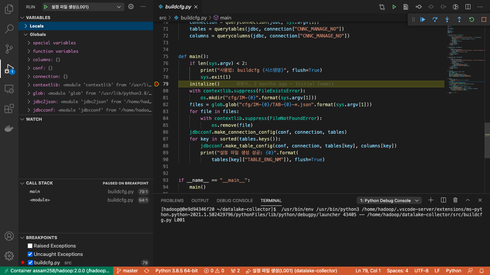

# DATALAKE COLLECTOR 빌드 및 디버깅 튜토리얼

이 문서에서는 Docker와 Visual Studio Code의 개발 환경을 구성하고, DATALAKE COLLECTOR의 패키지를 생성하고 디버깅하는 방법을 기술한다.
DATALAKE의 개발 환경은 Docker Image로 구성되어 있으며 개발에 필요한 Hadoop, Hive, DBMS, HTTP Proxy가 모두 포함되어 있다.
또, 테스트 환경 구성에 필요한 데이터들도 Docker Image에 포함되어 있다.

> 별도의 환경에서 개발 환경을 구성하고자 하는 경우, Docker Image 내의 설치된 파일들과 `entrypoint.sh` 파일을 참조하여 구성할 수있다.

 

## 목차

* [Docker의 설치 및 환경 구성](#Docker의-설치-및-환경-구성)
* [소스 코드의 복제 및 빌드](#소스-코드의-복제-및-빌드)
* [원격 Visual Studio Code에서의 Debugging](#원격-Visual-Studio-Code에서의-Debugging)

 

## Docker의 설치 및 환경 구성

본 단원에서는 Docker의 설치 및 Docker 상에서의 개발 환경 구성 절차를 기술한다.

 

### Docker의 설치

웹사이트 [https://www.docker.com/products/docker-desktop "Docker Download"](https://www.docker.com/products/docker-desktop)에서 `Docker Desktop`을 다운로드 받아 설치한다.

Windows와 Mac OS의 경우 설치본을 받아 설치를 진행하면 어렵지 않게 설치할 수 있다.
하지만 Linux의 경우는 설치 방법이 복잡하며 배포본에 따른 차이가 있어, 웹사이트 [https://docs.docker.com/engine/install/](https://docs.docker.com/engine/install/ "Docker Install")와 그 아래의 `Installation per distro` 항목을 참조하여 설치한다.

 

### Docker 이미지 다운로드

Docker 이미지를 다운로드 받기 위해서 사용하는 운영체제에 따라 Shell, 명령프롬프트 혹은 PowerShell에서 `docker pull` 명령을 수행한다.

~~~
$ docker pull assam258/hadoop:1.0.2
1.0.2: Pulling from assam258/hadoop
...생략...
Digest: sha256:230e4638e0a10fb8486c119bd0ea3dfd1de1195d3892d8685b9a3cbe296f6eac
Status: Downloaded newer image for assam258/hadoop:1.0.2
docker.io/assam258/hadoop:1.0.2
~~~

`docker images` 명령으로 다운로드 받은 이미지의 목록을 확인할 수 있다.

~~~
$ docker images
REPOSITORY                         TAG        IMAGE ID       CREATED             SIZE
assam258/hadoop                    1.0.2      8301f08efd4b   47 hours ago        3.39GB
~~~

 

### Docker 컨테이너의 생성

`docker create` 명령으로 앞에서 다운로드 받은 Docker 이미지로 부터 Docker 컨테이너를 생성한다.

~~~
$ docker create --name hadoop --hostname docker assam258/hadoop:1.0.2
143068a45fc69460698015a31005ec7095af71c80edbc3e5db7f91556447bf05
~~~

`docker ps` 명령으로 생성된 컨테이너의 목록을 확인할 수 있다.

~~~
$ docker ps -a
CONTAINER ID   IMAGE                   COMMAND                  CREATED         STATUS    PORTS     NAMES
eef87e88b621   assam258/hadoop:1.0.2   "/home/hadoop/entryp…"   2 seconds ago   Created             hadoop
~~~

 

### Docker 컨테이너의 구동

`docker start` 명령으로 Docker 컨테이너를 구동할 수 있다.

~~~
$ docker start hadoop
hadoop
~~~

위에서와 같이 `docker ps` 명령으로 수행 중인 컨테이너의 상태를 확인할 수 있다.

 

### Docker 컨테이너의 로그 확인

`docker logs` 명령으로 실행 중인 컨테이너의 로그를 확인할 수 있다.

~~~
$ docker logs -f hadoop
[ START SSH-SERVER ]
Pseudo-terminal will not be allocated because stdin is not a terminal.
...생략...
[ START HIVE ]
2021-02-15 02:00:43: Starting HiveServer2
SLF4J: Class path contains multiple SLF4J bindings.
SLF4J: Found binding in [jar:file:/home/hadoop/hive/lib/log4j-slf4j-impl-2.6.2.jar!/org/slf4j/impl/StaticLoggerBinder.class]
SLF4J: Found binding in [jar:file:/home/hadoop/hadoop/share/hadoop/common/lib/slf4j-log4j12-1.7.25.jar!/org/slf4j/impl/StaticLoggerBinder.class]
SLF4J: See http://www.slf4j.org/codes.html#multiple_bindings for an explanation.
SLF4J: Actual binding is of type [org.apache.logging.slf4j.Log4jLoggerFactory]
^C
~~~

`Ctrl-C`를 입력하여 로그 출력을 중단할 수 있다.

 

### Docker 컨테이너 내의 Shell 수행

`docker exec` 명령으로 `bash`을 수행하여 Docker 컨테이너 내의 Shell을 수행할 수 있다.

~~~
$ docker exec -it hadoop bash
[hadoop@docker ~]$ 
~~~

아래와 같이 `bash` 이외의 다른 Shell 명령어와 인자를 사용하여 호출할 수도 있다.

~~~
$ docker exec -it hadoop ls -l
total 36
-rwxr-xr-x  1 hadoop hadoop 2318  1월 28 01:43 entrypoint.sh
drwxr-xr-x  2 hadoop hadoop 4096  2월 13 03:34 files
drwxr-xr-x  1 hadoop hadoop 4096  2월 15 03:12 hadoop
drwxr-xr-x 10 hadoop hadoop 4096  2월 10 06:10 hive
drwxr-xr-x  5 hadoop hadoop 4096  2월 10 06:10 httpd
drwx------ 19 hadoop hadoop 4096  2월 15 03:12 pgdata
drwxr-xr-x  6 hadoop hadoop 4096  2월 10 06:10 postgresql
-rwxrwxr-x  1 hadoop hadoop   96 12월 23 05:35 shutdown.sh
drwxr-xr-x  8 hadoop hadoop 4096  2월 10 06:10 tomcat
-rw-rw-r--  1 hadoop hadoop    0 12월 23 05:35 uninitialized
~~~

 

### Docker 컨테이너의 종료

`docker exec` 명령으로 `./shutdown.sh`을 수행하여 Docker 컨테이너를 종료할 수 있다.

~~~
$ docker exec -it hadoop ./shutdown.sh
[ STOP HIVE ]
~~~

아래의 `docker logs` 명령으로 컨테이너의 종료가 완료될 때까지 대기할 수 있다.

~~~
$ docker logs -f hadoop
[ STOP HIVE ]
[ STOP HDFS ]
...생략...
[ STOP POSTGRESQL ]
...생략...
[ STOP HTTPD ]
[ STOP SSH-SERVER ]
[ DONE SHUTDOWN ]
~~~

 

### Docker 컨테이너의 삭제

`docker rm` 명령으로 정지 상태의 Docker 컨테이너를 삭제할 수 있다.

~~~
$ docker rm hadoop
hadoop
~~~

 

### Docker 이미지의 삭제

`docker rmi` 명령으로 사용하지 않는 Docker 이미지를 삭제할 수 있다.

~~~
$ docker rmi assam258/hadoop:1.0.2
Untagged: assam258/hadoop:1.0.2
Untagged: assam258/hadoop@sha256:230e4638e0a10fb8486c119bd0ea3dfd1de1195d3892d8685b9a3cbe296f6eac
Deleted: sha256:8301f08efd4be66947e99992042ff049ff201fac86e73c5a6a74ae0e2c63cb65
~~~

Docker 이미지의 다운로드 시와 같이 `docker images` 명령으로 이미지의 목록을 확인할 수 있다.

 

## 소스 코드의 복제 및 빌드

본 단원에서는 Docker 컨테이너 상에서 소스 코드를 복제하는 방법과 빌드, 패키징을 수행하는 절차를 기술한다.

 

### 소스 코드의 복제

`git clone` 명령으로 GitLab에서 소스 코드를 복제할 수 있다.

~~~
$ docker exec -it hadoop bash
[hadoop@docker ~]$ git clone http://210.108.181.161/hyunsu.choi/datalake-collector.git
Cloning into 'datalake-collector'...
...생략...
Receiving objects: 100% (1691/1691), 277.44 MiB | 11.39 MiB/s, done.
Resolving deltas: 100% (1091/1091), done.
Updating files: 100% (234/234), done.
[hadoop@docker ~]$ cd datalake-collector/
[hadoop@docker ~/datalake-collector]$ 
~~~

이하의 빌드 과정은 디렉토리 `datalake-collector`로 이동하여 수행하는 것을 가정한다.

 

### 자바 패키지의 빌드

JDBC/Hive의 접속 및 데이터 복제에 사용되는 JAVA 패키지는 빌드된 상태로 Git Repository에 변경이 없다면 별도로 빌드를 할 필요는 없다. 하지만, JAVA 코드의 변경이 있다면 새롭게 빌드하고 Git Repository에 반영할 필요가 있다.

자바 패키지의 빌드는 다음과 같은 과정에 의해서 수행된다.

아래의 $DATALAKE_COLLECTOR/java/pom.xml 파일의 `<version>` 태그의 값을 수정한다.

~~~
<project xmlns="http://maven.apache.org/POM/4.0.0" xmlns:xsi="http://www.w3.org/2001/XMLSchema-instance" xsi:schemaLocation="http://maven.apache.org/POM/4.0.0 http://maven.apache.org/maven-v4_0_0.xsd">
	<modelVersion>4.0.0</modelVersion>

	<groupId>kr.co.penta</groupId>
	<artifactId>datalake-collector</artifactId>
	<packaging>jar</packaging>
	<version>1.0.2</version>
	<name>datalake-collector</name>
	<description>Project for JDBC Result to JSON</description>

...생략...

</project>
~~~

인터페이스 상의 호환성을 유지하며 기능이 확장되는 경우는 마지막 숫자인 Patch Number를 1 증가시킨다.
인터페이스 상의 호환성이 유지되니 않는 경우 중간의 숫자인 Miner Version을 1 증가시키고, Patch Number는 0으로 변경한다.

`Makefile`과 `src/jdbcconf.py`, `java/build`, `java/build.cmd` 파일에서 `lib/datalake-collector-`로 시작하는 문자열을 모두 찾아 그 뒤의 버전을 `pom.xml`에서 수정한 버전과 같이 수정한다.

`lib` 디렉토리에서 기존 버전의 `datalake-collector-*.jar` 파일을 삭제한다.

~~~
[hadoop@docker ~/datalake-collector]$ rm lib/datalake-collector-*.jar
~~~

`make java` 명령을 수행하여 새로운 자바 패키지를 빌드한다.

~~~
[hadoop@docker ~/datalake-collector]$ make java
cd java; ./build
[INFO] Scanning for projects...
[INFO] 
[INFO] -------------------< kr.co.penta:datalake-collector >-------------------
[INFO] Building datalake-collector 1.0.2
[INFO] --------------------------------[ jar ]---------------------------------
...생략...
[INFO] --- maven-assembly-plugin:3.2.0:single (make-assembly) @ datalake-collector ---
[INFO] Building jar: /home/hadoop/datalake-collector/java/target/datalake-collector-1.0.2-jar-with-dependencies.jar
[INFO] ------------------------------------------------------------------------
[INFO] BUILD SUCCESS
[INFO] ------------------------------------------------------------------------
[INFO] Total time:  30.145 s
[INFO] Finished at: 2021-02-15T02:13:37Z
[INFO] ------------------------------------------------------------------------
~~~

`git add` 명령으로 수정된 파일들을 `staging 상태`로 변경한다.

~~~
[hadoop@docker ~/datalake-collector]$ git add {추가/수정/삭제 파일} ...
~~~

`git status` 명령으로 `staging 상태`로 변경된 파일들의 목록을 확인할 수 있다.

~~~
$ git status
On branch master
Your branch is up to date with 'origin/master'.

Changes to be committed:
  (use "git restore --staged <file>..." to unstage)
	modified:   Makefile
	modified:   java/build
	modified:   java/build.cmd
	modified:   java/pom.xml
	renamed:    lib/datalake-collector-1.0.2.jar -> lib/datalake-collector-2.0.1.jar
	modified:   src/jdbcconf.py

~~~

`git commit` 명령으로 변경된 내용을 Local Repository에 반영한다. 처음 수행할 경우 `user.email`과 `user.name`의 지정을 요청할 수 있음으로, 1회에 한하여 회사 E-Mail과 한글 이름을 `git config` 명령으로 지정한다.

~~~
[hadoop@docker ~/datalake-collector]$ git commit -m 'datalake-collector-2.0.1.jar 적용'

*** Please tell me who you are.

Run

  git config --global user.email "you@example.com"
  git config --global user.name "Your Name"

to set your account's default identity.
Omit --global to set the identity only in this repository.

fatal: unable to auto-detect email address (got 'hadoop@docker.(none)')
[hadoop@docker ~/datalake-collector]$ git config --global user.email "id@penta.co.kr"
[hadoop@docker ~/datalake-collector]$ git config --global user.name "당신의 이름"
[hadoop@docker ~/datalake-collector]$ git commit -m 'datalake-collector-2.0.1.jar 적용'
[master 26afd6f] datalake-collector-2.0.1.jar 적용
 6 files changed, 7 insertions(+), 7 deletions(-)
 rename lib/{datalake-collector-1.0.2.jar => datalake-collector-2.0.1.jar} (99%)
~~~

> `git push` 명령으로 변경된 내용을 `Remote Repository`에 반영할 수 있으나, `master` 브랜치에 반영할 경우 싸이트 별 수행 코드가 모두 반영되어 문제가 발생할 수 있음으로 `수행 기관의 영문 약어로 브랜치`를 만들고 `Remote Repository`에 반영할 것을 권장한다. 
> 각 브랜치에 반영된 수정 내역들은 `1년에 한번 정도 수정 내용을 취합하여 유용한 항목을 취사 선택`하여 `master` 브랜치에 병합하고 버전을 개정하는 것이 좋을 것 입니다.

 

### 배포 패키지의 빌드

Python 코드에 변경이 있을 경우는 `git add` 명령으로 추가 및 수정된 파일을 추가하여야 합니다. 
또, 디렉토리 `bin`이나 `src`에 새롭게 추가된 파일이 있거나 `문서`파일이나 그 `종속파일`이 추가되어 배포되어야 할 경우는 `Makefile`에 `package` 항목에 추가되어 기술되어야 합니다.

추가 혹은 변경된 파일은 `git add` 명령으로 `staging 상태` 변경 후 Commit 하여야 하니다.

~~~
[hadoop@docker ~/datalake-collector]$ git add {추가/수정/삭제 파일} ...
[hadoop@docker ~/datalake-collector]$ git status
화면에 출력된 수정 내역을 확인한다.
[hadoop@docker ~/datalake-collector]$ git commit -m '수정 내역을 UTF-8의 한글로 기술'
~~~

> `git push` 명령으로 변경된 내용을 `Remote Repository`에 반영할 수 있으나, `master` 브랜치에 반영할 경우 싸이트 별 수행 코드가 모두 반영되어 문제가 발생할 수 있음으로 `수행 기관의 영문 약어로 브랜치`를 만들고 `Remote Repository`에 반영할 것을 권장한다. 
> 각 브랜치에 반영된 수정 내역들은 `1년에 한번 정도 수정 내용을 취합하여 유용한 항목을 취사 선택`하여 `master` 브랜치에 병합하고 버전을 개정하는 것이 좋을 것 입니다.

패키지 파일을 생성하기 전에 먼저 `make test` 명령로 Unit Test를 수행하여 모든 항목이 `성공` 하는 것을 확인한다.

~~~
[hadoop@docker ~/datalake-collector]$ make test
cd test; ./test.sh
...생략...
==== 설정 파일 생성 테스트 ====
[성공] 설정 파일 생성(L001)
...생략...
==== 저장소 자동 생성 테스트 ====
[성공] Hive 테이블 생성
...생략...
==== 수집/적재 테스트 ====
[성공] Hive 테이블 생성
...생략...
==== OPENAPI 테스트 ====
[성공] OPENAPI 적재
...생략...
==== 배치 테스트 ====
[성공] 내부 배치
...생략...
[성공] 결과 검증
~~~

만약 `실패`한 항목이 있을 경우 아래의 [Debugging](#원격-Visual-Studio-Code에서의-Debugging) 단원을 참초하여 모든 결함을 수정한 후에 패키징을 수행하여야 한다.

`make package` 명령으로 패키지를 생성한다.

~~~
[hadoop@docker ~/datalake-collector]$ make package
rm -rf package/datalake-collector
mkdir package/datalake-collector
mkdir package/datalake-collector/bin
...생략...
datalake-collector/python/xmltodict-0.12.0-py2.py3-none-any.whl
datalake-collector/python/urllib3-1.26.2-py2.py3-none-any.whl
datalake-collector/python/six-1.15.0-py2.py3-none-any.whl
~~~

Docker에서 나온 후 운영체제에 따라 Shell, 명령프롬프트 혹은 PowerShell에서 `docker cp` 명령을 수행하여 생성된 파일을 Docker의 밖으로 복제할 수 있다.

~~~
[hadoop@docker ~/datalake-collector]$ exit
$ docker cp hadoop:/home/hadoop/datalake-collector/datalake-collector.tgz .
~~~

> 복제된 `패키지 파일`은 [README.md](README.md) 파일에 기술된 절차에 따라 설치하여 사용할 수 있다.

 

## 원격 Visual Studio Code에서의 Debugging

본 단원에서는 `Visual Studio Code를 설치`하고 `Docker 컨테이너의 개발 환경`에서 개발을 수행하고 Debugging을 수행하는 방법을 기술한다.

 

### Visual Studio Code의 설치

웹사이트 [https://code.visualstudio.com](https://code.visualstudio.com)에서 `Visual Studio Code 설치 파일`을 받아 설치한다.

> 네트워크에 연결할 수 없는 상황에서는 `vsix` 디렉토리의 `VSCodeSetup-x64-1.53.2.exe`를 설치하는 것으로 대신할 수 있다.

Windows, Linux, Mac OS의 OS 종류에 따라 설치 방식의 차이는 있으나 `Download`를 클릭하면 `설치 파일의 다운로드`와 함께 사용법에 대한 문서가 화면 상에 표시된다. 왼쪽의 `SETUP`을 선택한 후에 각 `OS 명을 선택`하면 자세한 설치 방법이 기술되어 있음으로 참고하여 설치한다. 이 [문서](https://code.visualstudio.com/docs)에는 설치 방법 외에도 다양한 언어에 대한 설정 방법과 디버깅 방법등이 기술되어 있어 `BOOKMARK` 해두는 것을 권장한다.

 

### 권장 Extension의 설치

Visual Studio Code는 기본적으로 편집기로 개발되었지만, Extension의 설치에 따라 여러 종류의 프로그램 언어의 빌드 및 디버깅도 수행할 수 있는 IDE에 필적할 수 있는 기능을 제공하고 있다. 개발의 편의성을 위해서 Visual Studio Code의 설치 직후에 다음의 `20개의 Extension`들을 먼저 설치하기를 권장한다.

| Extension 이름 | 종속 Extension | 기능 설명 |
|---|---|---|
| [C/C++](https://marketplace.visualstudio.com/items?itemName=ms-vscode.cpptools) | | C/C++ 소스의 빌드 및 디버깅 |
| [Docker](https://marketplace.visualstudio.com/items?itemName=ms-azuretools.vscode-docker) | | Docker 파일 편집, 빌드 및 배포 관리 |
| [Draw.io Integration](https://marketplace.visualstudio.com/items?itemName=hediet.vscode-drawio) | | 무료 다이어그램 편집툴 |
| [Excel Viewer](https://marketplace.visualstudio.com/items?itemName=GrapeCity.gc-excelviewer) | | CSV 파일을 표 형식으로 출력 및 정렬, 필터링 |
| [GitLens — Git supercharged](https://marketplace.visualstudio.com/items?itemName=eamodio.gitlens) | | GitHub 연계, 코드 브라우징 및 History 관리 등 |
| [hexdump for VSCode](https://marketplace.visualstudio.com/items?itemName=slevesque.vscode-hexdump) | | 16진수로 파일 내용 보기 |
| [Java Extension Pack](https://marketplace.visualstudio.com/items?itemName=vscjava.vscode-java-pack) | | 자바 개발과 관련된 인기있는 Extension의 모음집 |
| | Language Support for Java(TM) by Red Hat | 자바 코드 편집 등의  다양한 기능을 지원 |
| | Debugger for Java | 경량 자바 디버거 |
| | Java Test Runner | 자바 테스트 케이스 수행기 |
| | Maven for Java | Maven 프로젝트 관리 및 수행 등의 다양한 기능  |
| | Project Manager for Java | VSCode에서 자바 프로젝트 관리 |
| | Visual Studio IntellieCode | VSCode에서 Python, JavaScript, 자바 개발의 AI-도우미 |
| [Jupyter](https://marketplace.visualstudio.com/items?itemName=ms-toolsai.jupyter) | | Intellisense에 기반하여 다양한 언어의 상호 작용형 프로그래밍 개발 지원 |
| [Markdown Preview Mermaid Support](https://marketplace.visualstudio.com/items?itemName=bierner.markdown-mermaid) | | Markdown 프리뷰에 Mermaid 다이어그램과 플로우차트 지원 |
| [Pylance](https://marketplace.visualstudio.com/items?itemName=ms-python.vscode-pylance) | | Python 타입 검사 및 프로그램 분석 |
| [Python](https://marketplace.visualstudio.com/items?itemName=ms-python.python) | | Python의 코드 편집 지원 및 디버깅 등 다양한 기능 지원 |
| [Remote - Containers](https://marketplace.visualstudio.com/items?itemName=ms-vscode-remote.remote-containers) | | Docker 컨테이너 내에서의 개발 기능 지원 |
| [Remote - SSH](https://marketplace.visualstudio.com/items?itemName=ms-vscode-remote.remote-ssh) | | SSH로 원격 서버에서의 개발 기능 지원 |
| | Remote - SSH: Editing Configuration Files  | SSH 원격 개발을 위한 SSH Configuration 파일 편집   |

> VSCode가 수행 중인 상태에서 `위의 표의 링크`를 클릭 후 생성되는 화면에서 `Install`을 클릭 하면 설치할 수 있다. 
> 네트워크에 연결할 수 없는 상황에서는 좌측 탭 `Extensions` 선택 후 우상단의 `Views and More Actions…`의 `Install from VSIX…`에서 `vsix` 디렉토리의 `*.visx` 파일(구버전)들을 설치하는 것으로 대신할 수 있다.

 

### Java11 설치

다음의 링크([OpenJDK](https://jdk.java.net/archive/))에서 `OpenJDK11`을 받아 `VSCode가 설치된 환경`에 설치한다.
> Java11은 `VSCode의 Extension에서 사용`하기 위해서 설치하며, 패키지의 빌드를 위해서는 Docker 컨테이너 상에 이미 설치된 별도의 `Java8`을 사용한다.

 

### Remote Development 환경 구성 

먼저 [Docker의 설치 및 환경 구성](#Docker의-설치-및-환경-구성)에 따라 Docker 컨테이너를 수행하고 Git으로 소스 코드를 복제한 후 아래의 순서에 따라 VSCode에서 편집 및 디버깅을 수행할 수 있다.

* VSCode의 왼쪽 탭에서 `Remote Explorer`를 클릭한다.

  

* VSCode의 상단의 `REMOTE EXPLORER`의 오른쪽 콤보박스에서 `Containers`를 선택한다.

  

* 그 아래의 `CONTAINERS`에서 `assam258/hadoop:1.0.2 (/hadoop)`을 선택하고 오른쪽의 아이콘 중 `Attach to Container`를 클릭한다.

  

* 새로운 창이 생성되면 `Open Folder`를 선택하고 `/home/hadoop` 아래의 `datalake-collector` 디렉토리를 선택한 후 `OK`를 클릭한다.

  

  > 이후 부터 `REMOTE EXPLORER`의 오른쪽 콤보박스에서 `Containers`에 `datalake-collector` 디렉토리가 표시되며 바로 접근할 수 있다.

> 네트워크에 연결할 수 없는 상황에서는 연결 시도 후 `/home/hadoop/.vscode-server/bin/622cb03f7e070a9670c94bae1a45d78d7181fbd4/` 디렉토리에서 `vsix/vscode-server-linux-x64.tar.gz` 파일의 압축을 `tar xvzf ~/datalake-collector/vsix/vscode-server-linux-x64.tar.gz --strip-components 1` 해제한 후 연결을 재시도한다. 

 

### 디버그를 위한 환경 구성

테스트 스크립트 `test/test.sh`의 선두 부분의 아래의 명령을 수행하여 디버그 수행을 위한 설정과 DBMS를 초기화 할 수 있다.

~~~
[hadoop@docker ~/datalake-collector]$ cd $DATALAKE_COLLECTOR/test
[hadoop@docker ~/datalake-collector]$ rm -f data/*.db data/*.db-journal out/*
[hadoop@docker ~/datalake-collector]$ cp cfg/healthcheck.json "$DATALAKE_COLLECTOR"/cfg/healthcheck.json
[hadoop@docker ~/datalake-collector]$ rm -rf "$DATALAKE_COLLECTOR"/cfg/IM-* "$DATALAKE_COLLECTOR"/cfg/datalake.json
[hadoop@docker ~/datalake-collector]$ sqlite3 data/ruledb.db <<EOF
.read "$DATALAKE_COLLECTOR/sql/schema.sql"
.mode csv
.import data/t_rule_meta_0001.csv t_rule_meta_0001
.import data/t_rule_meta_0002.csv t_rule_meta_0002
.import data/t_rule_meta_0003.csv t_rule_meta_0003
EOF
[hadoop@docker ~/datalake-collector]$ psql -U hadoop hadoop <<EOF >/dev/null
\i data/source.sql
EOF
[hadoop@docker ~/datalake-collector]$ sqlite3 data/target.db <<EOF
.read "data/target.sql"
EOF
[hadoop@docker ~/datalake-collector]$ beeline -u "jdbc:hive2://localhost:10000" -e "drop database if exists st_m001 cascade;"
[hadoop@docker ~/datalake-collector]$ beeline -u "jdbc:hive2://localhost:10000" -e "create database st_m001;"
[hadoop@docker ~/datalake-collector]$ beeline -u "jdbc:hive2://localhost:10000" -e "drop database if exists st_kea_l001 cascade;"
[hadoop@docker ~/datalake-collector]$ beeline -u "jdbc:hive2://localhost:10000" -e "create database st_kea_l001;"
[hadoop@docker ~/datalake-collector]$ beeline -u "jdbc:hive2://localhost:10000" -e "drop database if exists st_kea_r001 cascade;"
[hadoop@docker ~/datalake-collector]$ beeline -u "jdbc:hive2://localhost:10000" -e "create database st_kea_r001;"
[hadoop@docker ~/datalake-collector]$ beeline -u "jdbc:hive2://localhost:10000" -e "drop database if exists st_api_001 cascade;"
[hadoop@docker ~/datalake-collector]$ beeline -u "jdbc:hive2://localhost:10000" -e "create database st_api_001;"
[hadoop@docker ~/datalake-collector]$ "$DATALAKE_COLLECTOR/bin/healthcheck"
~~~
> `make test` 명령으로 [배포 패키지의 빌드](#배포-패키지의-빌드)의 `Unit Test`를 1회 수행하여 동일한 결과를 얻을 수 있다.

 

### 상호 작용형 디버거 수행

다음과 같이 수행하여 상호 작용형 디버거를 수행할 수 있다.

* VSCode의 왼쪽 탭에서 `Run`를 클릭한다.

  

* VSCode의 상단의 `RUN`의 오른쪽 콤보박스에서 `디버그 대상`를 선택한다.

  

* `F5`키로  `디버그 대상` 프로그램을 수행한다.

  

  > 프로그램 수행 전 소스 편집 화면에서 라인 번호의 왼쪽을 클릭하여 브레이크 포인트를 설정할 수 있으며, `F10`과 `F11`로 `Step-Over`와 `Step-In`을 수행하며 코드를 따라갈 수 있다. 
  > 자세한 설명은 VSCode의 [문서](https://code.visualstudio.com/docs)를 참조한다.

콤보 박스의 순에서 따라 `====`로 시작하지 않는 항목들을 순서대로 수행하면 모든 항목을 테스트할 수 있으며, 처음 사용시에는 각 항목의 시작 함수에 브레이크 포인트를 설정하고 라인 순으로 순차적으로 수행하여 분석할 것을 권장한다.

다음에 각 `디버그 대상` 항목의 목록과 설명을 기술한다.

| 테스트명 | 프로세스 및 쓰레드 시작 함수 | 설명 |
|---|---|---|
| | **==== Java 테스트 ====** | |
| Version | kr.co.penta.datalake.version.Application.main() | DBMS 버전 출력 |
| Cryptograph | kr.co.penta.datalake.common.Aes:main() | 비밀번호 암복호화 |
| Create Table | kr.co.penta.datalake.jdbc2json.Application:main() | 테이블 생성 예제 |
| Insert Table | kr.co.penta.datalake.jdbc2json.Application:main() | 레코드 입력 예제 |
| | **==== 설정 파일 생성 테스트 ====** | |
| 설정 파일 생성(L001) | src/buildcfg.py:main()  | 시스템 L001 설정 파일 생성 |
| 설정 파일 생성(R001) | src/buildcfg.py:main()  | 시스템 R001 설정 파일 생성 |
| 설정 파일 생성(template1) | src/buildcfg.py:main()  | 시스템 template1 설정 파일 생성 |
| 설정 파일 생성(template2) | src/buildcfg.py:main()  | 시스템 template2 설정 파일 생성 |
| 설정 파일 생성(template3) | src/buildcfg.py:main()  | 시스템 template3 설정 파일 생성 |
| 설정 생성 | src/createcfg.py:main() | DBMS 연결 정보로 시스템 설정 파일 생성 |
| 메타 수집 | src/jdbcmeta.py:main() | DBMS에서 스키마, 테이블 및 컬럼 정보 추축 |
| Rule 생성 | src/buildrule.py:main() | 추출된 META와 백업한 Rule에서 새로운 Rule 생성 |
| Rule 수정 | src/updaterule.py:main() | 새로운 Rule을 Rule 데이터베이스에 반영 |
| Rule 백업 | src/backuprule.py:main() | Rule 데이터베이스에서 현재의 Rule을 백업 |
| Rule 복구 | src/restorerule.py:main() | Rule 데이터베이스에서 백업된 Rule을 복원 |
| 설정 파일 생성(M001) | src/buildcfg.py:main() | 시스템 M001 설정 파일 생성 |
| | **==== 쿼리 수행 ====** | |
| JDBC Version 조회 | src/jdbcversion.py:main() | 시스템들의 DBMS 버전 출력 |
| JDBC Shell | src/jdbcshell.py:main() | 원천 DBMS에 JDBC로 접속한 Shell 생성 |
| Hive Shell | src/hiveshell.py:main() | Hive에 접속한 Shell 생성 |
| | **==== 저장소 자동 생성 테스트 ====** | |
| Hive 테이블 생성 | src/hivecreatetable.py:main(),worker() | Hive 시스템 테이블들을 생성 |
| Hive 파티션 생성(20200101) | src/hivecreatepartition.py:main(),worker() | Hive 시스템 테이블들의 파티션을 생성 |
| Hive 파티션 생성(20200201) | src/hivecreatepartition.py:main(),worker() | Hive 시스템 테이블들의 파티션을 생성 |
| Hive 파티션 목록 | src/hivelistpartition.py:main(),worker() | Hive 시스템 테이블들의 파티션 목록 조회 |
| Hive 파티션 정리(20200101) | src/hiveclearpartition.py:main(),worker() | Hive 시스템 테이블들의 지정된 파티션 이외의 파티션들을 삭제 |
| Hive 파티션 삭제(20200101) | src/hivedroppartition.py:main(),worker() | Hive 시스템 테이블들의 파티션을 삭제 |
| Hive 테이블 초기화 | src/hivetruncatetable.py:main(),worker() | Hive 시스템 테이블들의 모든 레코드를 삭제 |
| Hive 테이블 삭제 | src/hivedroptable.py:main(),worker() | Hive의 시스템 테이블들을 삭제 |
| | **==== 수집/적재 테스트 ====** | |
| Hive 테이블 생성 | src/hivecreatetable.py:main(),worker() | Hive 시스템 테이블들을 생성 |
| Hive 파티션 생성(20200101) | src/hivecreatepartition.py:main(),worker() | Hive 시스템 테이블들의 파티션을 생성 |
| JDBC to SequenceFile 수집/적재 | src/jdbc2seqfile.py:main(),worker() | DBMS 테이블들을 Hive 테이블들에 수집/적재 |
| Hive 파티션 생성(20200201) | src/hivecreatepartition.py:main(),worker() | Hive 시스템 테이블들의 파티션을 생성 |
| CSV to SEQUENCEFILE 적재 | src/csv2seqfile.py:main() | CSV 파일을 Hive의 테이블에 적재 |
| JDBC to JDBC 수집/적재 | src/jdbc2jdbc.py:main() | DBMS/테이블간에 레코드를 복제 |
| Hive 테이블 분석 | src/hiveanalyze.py:main(),worker() | Hive 시스템 테이블들의 통계 데이터를 분석 |
| JDBC 레코드 수 | src/jdbccount.py:main(),worker() | DBMS 시스템 테이블들의 레코드수를 수집 |
| Hive 레코드 수 | src/hivecount.py:main(),worker() | Hive 시스템 테이블들의 레코드수를 수집 |
| 비식별화 검증 | src/jdbc2csv.py:main() | DBMS 테이블의 수집된 데이터의 비식별화 검증 |
| Hive 적재 데이터 검증 | src/hive2csv.py:main() | Hive에 적재된 테이블의 검증 |
| JDBC to JDBC 수집/적재 검증 | src/jdbc2csv.py:main() | DBMS/테이블간에 레코드를 복제 결과 검증 |
| CSV to SEQUENCEFILE 적재 검증 | src/hivequery.py:main() | CSV 파일을 Hive의 테이블에 적재 검증 |
| JDBC to SequenceFile 적재 검증 | src/hiveverify.py:main(),worker() | DBMS 테이블들을 Hive 테이블들에 수집/적재 결과 검증 |
| Target 테이블 초기화 | src/jdbctruncatetable.py:main(),worker() | DBMS 테이블들의 레코드 초기화 |
| Target 테이블 조회 | src/jdbcquery.py:main() | DBMS 테이블의 레코드 조회 |
| Hive 테이블 삭제 | src/hivedroptable.py:main(),worker() | Hive의 시스템 테이블들을 삭제 |
| | **==== OPENAPI 테스트 ====** | |
| OPENAPI 적재(template1) | openapi/template1.py:main() | OpenAPI 수집 및 Hive 테이블 적재 |
| OPENAPI 적재(template2) | openapi/template2.py:main() | OpenAPI 수집 및 Hive 테이블 적재 |
| OPENAPI 적재(template3) | openapi/template3.py:main() | OpenAPI 수집 및 Hive 테이블 적재 |
| OPENAPI 적재 검증(template1) | src/hiveverify.py:main(),worker() | OpenAPI 적재 결과 검증 |
| OPENAPI 적재 검증(template3)  | src/hiveverify.py:main(),worker() | OpenAPI 적재 결과 검증 |
| HIVE to JDBC 수집/적재 | src/hive2jdbc.py:main(),worker() | Hive에 수집된 결과를 DBMS에 복제 |
| Hive 테이블 삭제(template1) | src/hivedroptable.py:main(),worker() | Hive의 시스템 테이블들을 삭제 |
| Hive 테이블 삭제(template2)  | src/hivedroptable.py:main(),worker() | Hive의 시스템 테이블들을 삭제 |
| Hive 테이블 삭제(template3)  | src/hivedroptable.py:main(),worker() | Hive의 시스템 테이블들을 삭제 |
| | **==== 배치 테스트 ====** | |
| 헬스 체크 | src/healthcheck.py:main() | 배치 수행 전 접속 대상 장비 헬스 체크 |
| 내부 배치 | src/batchrun.py:main(),worker() | 내부 정형 데이터 수집 배치 |
| 외부 배치 | src/batchrun.py:main(),worker() | 외부 정형 데이터 수집 배치 |
| 일별 테이블 적재 | src/load004.py:main(),worker() | 일별 테이블을 파티션으로 수집 |
| 배치 결과(내부) | src/batchresult.py:main() | 내부 정형 데이터 수집 결과 수집  |
| 배치 결과(외부) | src/batchresult.py:main() | 외부 정형 데이터 수집 결과 수집 |
| 배치 검사 | src/batchcheck.py:main() | 배치 수행 걸과 검증 |
| | **==== 기타 ====** | |
| 암호 | src/secret.py:main() | 비밀번호 암복호화 |
| jdbc2json | kr.co.penta.datalake.jdbc2json.Application | JDBC2JSON 테스트 쉘 |

> 이 테스트의 수행을 위해서는 데이터베이스의 구성등이 필요하며 `test/test.sh`에 포함되어 있다. 
> `test/test.sh`를 먼저 한 번 수행한 후에 테스트를 수행하면 편하다. 
> `test/test.sh`와 그 아래에서 호출되는 `Unit Test`에서 수행되는 항목에서 중복되어 호출되는 항목들은 1회만 등록되어 있다. 하지만 `Unit Test`에서 호출되는 순서에 따라 반복하여 호출하여 `Unit Test`와 동일하게 수행할 수 있다.
