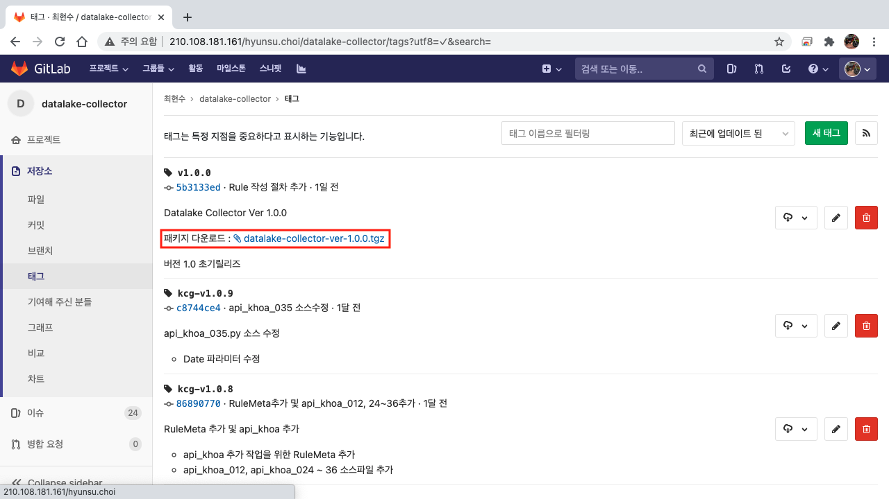
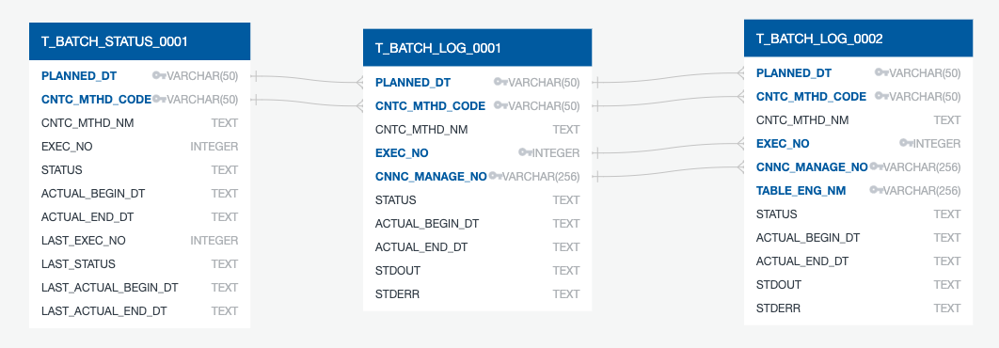
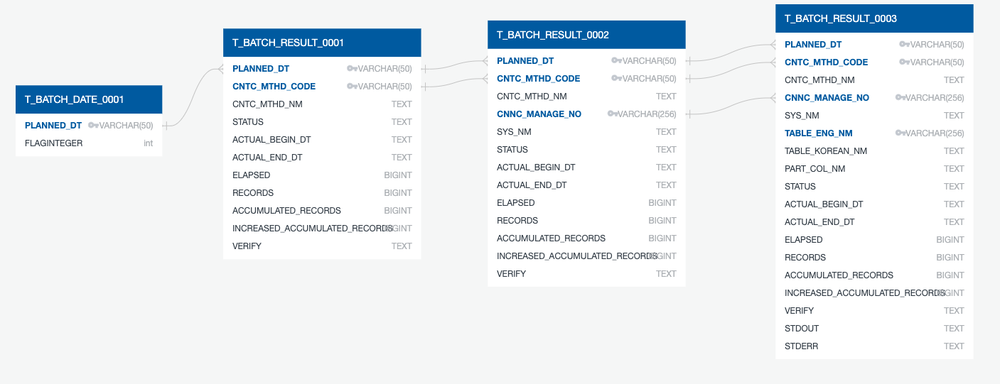

# DATALAKE COLLECTOR 설치 및 사용 설명서

이 문서에서는 RDMBS와 Web에서 JDBC와 HTTP로 자료를 수집하는 Daemon의 패키지의 사용법을 기술한다.

> 본 문서에서 사용된 SVG 파일들은 GitLab의 결함으로 GitLab 보여지지 않을 수 있다. Clone 후에 VSCode의 Preview로 SVG파일의 그림을 정상적으로 볼 수 있다.

 

## 목차

* [패키지 입수](#패키지-입수)
* [패키지 설치](#패키지-설치)
* [설정 파일 수정](#설정-파일-수정)
* [데이터베이스 구성](#데이터베이스-구성)
* [명령어 구성](#명령어-구성)
* [부록](#부록)
* [별첨 문서](#별첨-문서)

 

## 패키지 입수

Datalake Collector의 패키지는 GitLab 서버에서 입수할 수 있다.

* GitLab 서버의 [태그 목록(http://210.108.181.161/hyunsu.choi/datalake-collector/tags)](http://210.108.181.161/hyunsu.choi/datalake-collector/tags) 페이지에서 버전을 선택하여 패키지를 다운로드 한다.

  

 

## 패키지 설치

본 단원에서는 Datalake Collector의 설치와 관련 패키지의 설치 과정을 기술한다.

 

### 전제 조건

Datalake Collector의 수행을 위해서는 다음의 요소들이 설치된 것을 전제한다.

* Python 3
* Java 8
* Rule Database를 저장할 DBMS

> Rule Database는 JDBC를 제공하는 대부분의 DBMS를 사용할 수 있다. 
> 하지만, Datalake Collector는 PostgreSQL/SQLite3/MySQL(mariaDB)를 사용하여 테스트 되었으며, 함께 사용될 Datalake Dashboard는 PostgreSQL만을 사용하여 테스트 되었음으로 `PostgreSQL`을 권장한다.

 

### Datalake Collector의 설치

* 다운로드 받은 패키지를 `tar xvzf` 명령으로 압축해제한다.

  ~~~
  $ tar xvzf datalake-collector-ver-1.0.2.tgz
  datalake-collector/
  datalake-collector/README.md
  ...생략...
  datalake-collector/tmp/
  ~~~

* `DATALAKE_COLLECTOR` 환경 변수를 설정한다.

  ~~~
  $ export DATALAKE_COLLECTOR="$PWD/datalake-collector"
  $ PATH="$DATALAKE_COLLECTOR/bin":$PATH
  ~~~

  > `bash`를 기준으로 기술하였다. 다른 Shell을 사용하는 경우는 그에 맞게 수정하여 사용한다. 
  > 편의성을 위해서 Shell에 따라 `.profile` 파일 등에 추가하여 사용한다.

 

### Python 모듈의 설치

Datalake Collector에 수행에 필요한 Python 모듈들이 `$DATALAKE_COLLECTOR/python` 디렉토리에 포함되어 있으며 `pip-install.sh` 스크립트를 수행하여 설치할 수 있다.

~~~
$ cd "$DATALAKE_COLLECTOR/python"
$ sh pip-install.sh 
~~~

포함된 패키지의 목록은 아래와 같다.

| 패키지명 | 설명 |
|---|---|
| python-dateutil | datetime 모듈에서 제공하지 않는 보다 강력한 기능을 제공하는 모듈 |
| requests | urllib 모듈에서 제공하지 않는 HTTP 처리의 보다 개선된 기능을 제공하는 모듈 |
| xmltodict | python 변수를 xml로 상호 변환하는 기능을 제공하는 모듈 |

 

## 설정 파일 수정

 

### `datalake.json` 파일 설정

Datalake Collector의 명령들을 수행하기 위해서는 `$DATALAKE_COLLECTOR/cfg` 디렉토리에 `datalake.json` 설정 파일을 생성하여야 한다. 설정 파일의 개별 항목의 의미는 아래와 같다.

| 설정항목명 | 예제설정 | 설명 |
|---|---|---|
| repository |<pre>{   "repository": {     "classpath": "lib/postgresql-42.2.16.jar",     "classname": "org.postgresql.Driver",     "url": "jdbc:postgresql://host:5432/ruledb",     "username": "userid",     "password": "secret",     "fetchsize": "1000"     "check": "SELECT 1"   } }</pre>| Rule DBMS의 JDBC 접속 정보 |
| namenode |<pre>{   "namenode": {     "startswith": "hdfs://namespace/",     "newvalue": "hdfs://namenode1/"   } }</pre>| HDFS location이 namespace로 되어 있을 경우, 활성화된 namenode로 URL을 변경하기 위한 정보 항목이 없으면 URL을 변경하지 않음 |
| hive |<pre>{   "hive" : {     "classpath": "lib/hive-jdbc-2.3.7-standalone.jar",     "classname": "org.apache.hive.jdbc.HiveDriver",     "url": "jdbc:hive2://host:10000/",     "username": null,     "password": null,     "fetchsize": "1000"     "check": "SELECT 1"   } }</pre>| Hive의 JDBC 접속 정보 Cloudera의 classpath는 Cloudera와 Hive의 JDBC 두개를 사용하여야 하며 `classes.json` 파일을 참조하여 설정 |
| proxy  |<pre>{   "proxy": "http://host:8080" }</pre>| OpenAPI 수집시에 사용할 HTTP Proxy 서버의 주소 항목이 없으면 Proxy를 사용하지 않고 직접 요청 |
| condition |<pre>{    "condition": [     {       "BIGDATA_GTRN_AT": "Y"     },     {       "SCHDUL_APPLC_AT": "Y"     }   ] }</pre>| 테이블명 없이 연결관리번호만으로 명령을 실행할 경우 테이블을 선택하기 위한 필터 Rule DBMS의 테이블 정보의 컬럼값을 기준으로 필터링을 수행 `[]` 내의 각 항목들은 OR 조건으로 `{}` 내의 각 항목들은 AND 조건으로 작용 |
| cntc_mthd_nm |<pre>{   "cntc_mthd_nm": {     "01": "내부 정형 데이터",     "02": "외부 정형 데이터"   } }</pre>| 수집 유형을 정의 |
| csv |<pre>{   "csv": "tmp" }</pre>| 수집/적재된 테이블의 레코드들을 저장하는 CSV 파일의 저장 경로 없으면 `$DATALAKE_COLLECTOR/tmp`를 사용 |
| fetchsize |<pre>{   "fetchsize": "1000" }</pre>| SELECT 시 한 번에 서버로부터 가져올 레코드 수 |
| sample |<pre>{   "samples": "1000000" }</pre>| 테이블별 수집 최대 레코드 수 초기 테스트 시에 데이터 변환 검증 및 성능 예측을 위해 사용  |
| threads |<pre>{   "threads": "8" }</pre>| 명령에 의해서 동시에 수행될 테이블의 수를 지정 없으면 CPU의 Core 수를 사용 |
> `$DATALAKE_COLLECTOR/cfg/datalake.sample.json`을 복제 후 수정하여 사용하는 것을 권장한다.

 

### `healthcheck.json` 파일 설정

Rule 데이터베이스, Hive, HDFS namenode와 Proxy Server는 이중화(다중화)하여 구성할 수 있다.
`$DATALAKE_COLLECTOR/cfg` 디렉토리에 `healthcheck.json` 설정 파일을 생성한 후, `healthcheck` 명령을 수행하여 접속 가능한 자원을 선택하여 `datalake.json` 설정 파일을 자동으로 생성한 후 개별 명령들을 수행한다. 아래의 설정항목들을 list로 구성하여 사용한다.

* repository
* namenode.newvalue
* hive
* proxy

> `$DATALAKE_COLLECTOR/cfg/healthcheck.sample.json`을 복제 후 수정하여 사용하는 것을 권장한다.

 

### `classes.json` 파일 설정

DMBS 유형별로 접속 정보를 생성하는 방법이나 DBMS별로 다른 특성에 대해서 기술한다.
문자열로 기술된 경우는 Alias로 문자열 값과 동일한 항목에 기술된 내용을 사용한다.

> 대부분의 데이터베이스는 `$DATALAKE_COLLECTOR/cfg/classes.json`에 이미 기술되어 있으나, 포함되어 있지 않은 경우 JDBC Driver를 구하여 `$DATALAKE_COLLECTOR/lib` 디렉토리에 복사한 후 항목을 추가로 기술하여 사용한다.

 

### `datatypes.json` 파일 설정

DBMS의 컬럼별 데이터형에 따라 Hive에 대응되는 데이터형을 정의한다.
문자열로 기술된 경우는 Alias로 문자열 값과 동일한 항목에 기술된 내용을 사용한다.
항목명을 대문자로 기술되어야 하며, 추출/정의된 정보가 소문자를 사용하는 경우 대문자로 변환되어 처리된다.

> 상당수의 데이터형은 `$DATALAKE_COLLECTOR/cfg/datatypes.json`에 이미 기술되어 있으나, 포함되어 있지 않은 경우 `Alias` 항목을 추가로 기술하여 사용한다.

 

## 데이터베이스 구성

Rule 데이터베이스의 구성에 필요한 DDL문들은 `$DATALAKE_COLLECTOR/sql/schema.sql` 파일에 기술되어 있다. DBMS에 따라 적절히 수정하여 테이블을 생성한다.

| 테이블영문명 | 테이블한글명 | 설명 |
|---|---|---|
| T_RULE_META_0001 | 수집대상연결정보 | |
| T_RULE_META_0002 | DB테이블정보 | |
| T_RULE_META_0003 | DB속성정보 | |
| T_BATCH_STATUS_0001 | 배치수행상태정보  | |
| T_BATCH_LOG_0001 | 수집대상연결별배치로그 | |
| T_BATCH_LOG_0002 | DB테이블별배치로그 | |
| T_BATCH_DATE_0001 | 최종배치수행일시정보 | |
| T_BATCH_RESULT_0001 | 연계방식별배치결과| |
| T_BATCH_RESULT_0002 | 수집대상연결별배치결과 | |
| T_BATCH_RESULT_0003 | DB테이블별배치결과 | |

> 테이블 `T_RULE_META_????`, `T_BATCH_DATE_0001`, `T_BATCH_RESULT_????`은 상황판 GUI와 공유되어 사용된다.

 

### Entity Relationship Diagram

테이블 간의 연관관계는 아래와 같다.

 

### 수집대상연결정보(T_RULE_META_0001)

| 테이블속성영문명 | 테이블한글속성명 | 테이블속성타입명 | 설명 |
|---|---|---|---|
| CNNC_MANAGE_NO | 연결관리번호 | VARCHAR(256) | |
| SYS_NM | 시스템명 | TEXT | |
| CNTC_MTHD_CODE | 연계방식코드 | TEXT | `datalake.json`에 정의된 코드 |
| CNTC_MTHD_NM | 연계방식명 | TEXT | `datalake.json`에 정의된 명칭 |
| DB_TY_CODE | DB유형코드 | TEXT | `classes.json`에 정의된 코드 |
| DB_TY_NM | DB유형명 | TEXT | `classes.json`에 정의된 명칭 |
| DB_ACNT_NM | DB계정명 | TEXT | 스키마명 |
| HIVE_DB_NM | 하둡적재명 | TEXT | Hive 데이터베이스명|
| DB_SERVICE_NM | DB서비스명 | TEXT | DBMS의 서비스명 혹은 데이터베이스명 |
| DB_1_SERVER_IP | DB1서버IP | TEXT | |
| DB_1_SERVER_PORT_NO | DB1서버포트번호 | TEXT | |
| DB_2_SERVER_IP | DB2서버IP | TEXT | |
| DB_2_SERVER_PORT_NO | DB2서버포트번호 | TEXT | |
| DB_USER_ID | DB사용자ID | TEXT | |
| DB_USER_SECRET_NO | DB사용자비밀번호 | TEXT | 평문 비밀번호 혹은 `src/sceret.py`에 의해서 암호화된 비밀번호 |
| REMOTE_SERVER_IP | 원격서버IP | TEXT | |
| REMOTE_SERVER_PORT_NO | 원격서버포트번호 | TEXT | |
| REMOTE_SERVER_USER_ID | 원격서버사용자ID | TEXT | |
| REMOTE_SERVER_USER_SECRET_NO | 원격서버사용자비밀번호 | TEXT | |
| REMOTE_DRCTRY_NM | 원격디렉토리명 | TEXT | |
| DATA_TY_CODE | 데이터유형코드 | TEXT | |
| API_DATA_AUTHKEY_NM | OpenAPI데이터인증키명 | TEXT | |
| API_DATA_URL | OpenAPI데이터URL | TEXT | |
| NTWK_SE_CODE | 망구분코드 | TEXT | |
| NTWK_SE_NM | 망구분명 | TEXT | |
| APPLC_SE_CODE | 적용구분코드 | TEXT | |
| APPLC_SE_NM | 적용구분명 | TEXT | |
| REGIST_DE | 등록년월일 | TEXT | |
| REGIST_EMPL_NO | 등록사원번호 | TEXT | |
| UPDT_DE | 수정년월일 | TEXT | |
| UPDT_EMPL_NO | 수정사원번호 | TEXT | |

 

### DB테이블정보(T_RULE_META_0002)

| 테이블속성영문명 | 테이블한글속성명 | 테이블속성타입명 | 설명 |
|---|---|---|---|
| CNNC_MANAGE_NO | 연결관리번호 | VARCHAR(256) | |
| TABLE_ENG_NM | 테이블영문명 | VARCHAR(256) | |
| TABLE_KOREAN_NM | 테이블한글명 | TEXT | |
| TABLE_DC | 테이블설명 | TEXT | |
| BR_DC | 업무규칙설명 | TEXT | |
| HASHTAG_CN | 해시태그내용 | TEXT | |
| MNGR_NM | 관리자명 | TEXT | |
| PART_COLS | 파티션컬럼명 | TEXT | |
| WHERE_INFO_NM | Where정보명 | TEXT | |
| INS_NUM_MAPPERS | 매퍼수 | TEXT | |
| INS_SPLIT_BY_COL | 분할기준칼럼 | TEXT | |
| APD_WHERE | 변동적재기준조건 | TEXT | |
| APD_CHK_COL | 변동적재기준칼럼명 | TEXT | |
| HIVE_TABLE_NM | 하이브적재테이블영문명 | TEXT | 생략 시 `TABLE_ENG_NM`를 사용 |
| BIGDATA_GTRN_AT | 빅데이터수집여부 | TEXT | |
| SCHDUL_APPLC_AT | 스케쥴적용여부 | TEXT | |
| GTHNLDN_MTH_CODE | 수집적재방법코드 | TEXT | `000` OpenAPI 수집 `001` Drop Table 후 수집/적재 `002` Truncate후 수집/적재 `003` Drop Partition 후 수집/적재 `004` 일별 파티션 생성 후 수집/적재 `1000` 이상은 사용자 정의 |
| GTHNLDN_MTH_NM | 수집적재방법명 | TEXT | |
| REGIST_DE | 등록년월일 | TEXT | |
| REGIST_EMPL_NO | 등록사원번호 | TEXT | |
| UPDT_DE | 수정년월일 | TEXT | |
| UPDT_EMPL_NO | 수정사원번호 | TEXT | |

 

### DB속성정보(T_RULE_META_0003)

| 테이블속성영문명 | 테이블한글속성명 | 테이블속성타입명 | 설명 |
|---|---|---|---|
| CNNC_MANAGE_NO | 연결관리번호 | VARCHAR(256) | |
| TABLE_ENG_NM | 테이블영문명 | VARCHAR(256) | |
| DB_TABLE_ATRB_SN | DB테이블속성일련번호 | INTEGER | |
| TABLE_ATRB_ENG_NM | 테이블속성영문명 | VARCHAR(512) | |
| TABLE_KOREAN_ATRB_NM | 테이블한글속성명 | TEXT | |
| TABLE_ATRB_EXPR | 테이블속성변환식 | TEXT | 생략 시 `TABLE_ATRB_ENG_NM`를 사용 데이터형 변환 및 연산에 의한 값 수정 필요 시 사용 속성명이 키워드와 충돌 시 회피용으로 사용|
| TABLE_ATRB_DC | 테이블속성설명 | TEXT | |
| DSTNG_TRGET_AT | 비식별대상여부 | TEXT | |
| TABLE_ATRB_TY_NM | 테이블속성타입명 | TEXT | |
| TABLE_ATRB_LT_VALUE | 테이블속성길이값 | TEXT | |
| HIVE_COL_NM | Hive속성명문명 | TEXT | 생략 시 `TABLE_ATRB_ENG_NM`를 사용 |
| HIVE_ATRB_TY_NM | Hive속성타입명 | TEXT | 생략 시 `TABLE_ATRB_TY_NM`에서 유추 |
| TABLE_ATRB_NULL_POSBL_AT | 테이블속성NULL가능여부 | TEXT | |
| TABLE_ATRB_PK_AT | 테이블속성PK여부 | TEXT | |
| REGIST_DE | 등록년월일 | TEXT | |
| REGIST_EMPL_NO | 등록사원번호 | TEXT | |
| UPDT_DE | 수정년월일 | TEXT | |
| UPDT_EMPL_NO | 수정사원번호 | TEXT | |

 

### 배치수행상태정보(T_BATCH_STATUS_0001)

| 테이블속성영문명 | 테이블한글속성명 | 테이블속성타입명 | 설명 |
|---|---|---|---|
| PLANNED_DT | 배치계획수행일시 | VARCHAR(50) | 형식: YYYYMMDDHHMISS |
| CNTC_MTHD_CODE | 연계방식코드 | VARCHAR(50) | |
| CNTC_MTHD_NM | 연계방식명 | TEXT | |
| EXEC_NO | 배치수행회차 | INTEGER | |
| STATUS | 배치수행상태 | TEXT | 상태: WAITING/EXECUTING/SUCCESS/FAILURE |
| ACTUAL_BEGIN_DT | 배치실제시작일시 | TEXT | 형식: YYYYMMDDHHMISS |
| ACTUAL_END_DT | 배치실제종료일시 | TEXT | 형식: YYYYMMDDHHMISS |
| LAST_EXEC_NO | 최종배치수행회차 | INTEGER | |
| LAST_STATUS | 최종배치수행상태 | TEXT | 상태: WAITING/EXECUTING/SUCCESS/FAILURE |
| LAST_ACTUAL_BEGIN_DT | 최종배치실제시작일시 | TEXT | 형식: YYYYMMDDHHMISS |
| LAST_ACTUAL_END_DT | 최종배치실제종료일시 | TEXT | 형식: YYYYMMDDHHMISS |

 

### 수집대상연결별배치로그(T_BATCH_LOG_0001)

| 테이블속성영문명 | 테이블한글속성명 | 테이블속성타입명 | 설명 |
|---|---|---|---|
| PLANNED_DT | 배치계획수행일시 | VARCHAR(50) | 형식: YYYYMMDDHHMISS |
| CNTC_MTHD_CODE | 연계방식코드 | VARCHAR(50) | |
| CNTC_MTHD_NM | 연계방식명 | TEXT | |
| EXEC_NO | 배치수행회차 | INTEGER | |
| CNNC_MANAGE_NO | 연결관리번호 | VARCHAR(256) | |
| STATUS | 배치수행상태 | TEXT | 상태: WAITING/EXECUTING/SUCCESS/FAILURE |
| ACTUAL_BEGIN_DT | 배치실제시작일시 | TEXT | 형식: YYYYMMDDHHMISS |
| ACTUAL_END_DT | 배치실제종료일시 | TEXT | 형식: YYYYMMDDHHMISS |
| STDOUT | 배치실행결과로그 | TEXT | |
| STDERR | 배치오류결과로그 | TEXT | |

 

### DB테이블별배치로그(T_BATCH_LOG_0002)

| 테이블속성영문명 | 테이블한글속성명 | 테이블속성타입명 | 설명 |
|---|---|---|---|
| PLANNED_DT | 배치계획수행일시 | VARCHAR(50) | 형식: YYYYMMDDHHMISS |
| CNTC_MTHD_CODE | 연계방식코드 | VARCHAR(50) | |
| CNTC_MTHD_NM | 연계방식명 | TEXT | |
| EXEC_NO | 배치수행회차 | INTEGER | |
| CNNC_MANAGE_NO | 연결관리번호 | VARCHAR(256) | |
| TABLE_ENG_NM | | VARCHAR(256) | |
| STATUS | 배치수행상태 | TEXT | 상태: WAITING/EXECUTING/SUCCESS/FAILURE |
| ACTUAL_BEGIN_DT | 배치실제시작일시 | TEXT | 형식: YYYYMMDDHHMISS |
| ACTUAL_END_DT | 배치실제종료일시 | TEXT | 형식: YYYYMMDDHHMISS |
| STDOUT | 배치실행결과 | TEXT | |
| STDERR | 배치오류결과 | TEXT | |

 

### 최종배치수행일시정보(T_BATCH_DATE_0001)

| 테이블속성영문명 | 테이블한글속성명 | 테이블속성타입명 | 설명 |
|---|---|---|---|
| PLANNED_DT | 배치계획수행일시 | VARCHAR(50) | 형식: YYYYMMDDHHMISS |
| FLAG | 수행상태플래그 | INTEGER | 값이 `0`인 레코드만 유효 |

 

### 연계방식별배치결과(T_BATCH_RESULT_0001)

| 테이블속성영문명 | 테이블한글속성명 | 테이블속성타입명 | 설명 |
|---|---|---|---|
| PLANNED_DT | 배치계획수행일시 | VARCHAR(50) | 형식: YYYYMMDDHHMISS |
| CNTC_MTHD_CODE | 연계방식코드 | VARCHAR(50) | |
| CNTC_MTHD_NM | 연계방식명 | TEXT | |
| STATUS | 배치수행상태 | TEXT | 상태: WAITING/EXECUTING/SUCCESS/FAILURE |
| ACTUAL_BEGIN_DT | 배치실제시작일시 | TEXT | 형식: YYYYMMDDHHMISS |
| ACTUAL_END_DT | 배치실제종료일시 | TEXT | 형식: YYYYMMDDHHMISS |
| ELAPSED | 배치소요시간 | BIGINT | 단위: 초 |
| RECORDS | 일배치수집레코드수 | BIGINT | |
| ACCUMULATED_RECORDS | 테이블전체레코드수 | BIGINT | |
| INCREASED_ACCUMULATED_RECORDS | 테이블전체레코드증감수 | BIGINT | |
| VERIFY | | TEXT| 상태: SUCCESS/FAILURE |

 

### 수집대상연결별배치결과(T_BATCH_RESULT_0002)

| 테이블속성영문명 | 테이블한글속성명 | 테이블속성타입명 | 설명 |
|---|---|---|---|
| PLANNED_DT | 배치계획수행일시 | VARCHAR(50) | 형식: YYYYMMDDHHMISS |
| CNTC_MTHD_CODE | 연계방식코드 | VARCHAR(50) | |
| CNTC_MTHD_NM | 연계방식명 | TEXT | |
| CNNC_MANAGE_NO | 연결관리번호 | VARCHAR(256) | |
| SYS_NM | 시스템명 | TEXT | |
| STATUS | 배치수행상태 | TEXT | 상태: WAITING/EXECUTING/SUCCESS/FAILURE |
| ACTUAL_BEGIN_DT | 배치실제시작일시 | TEXT | 형식: YYYYMMDDHHMISS |
| ACTUAL_END_DT | 배치실제종료일시 | TEXT | 형식: YYYYMMDDHHMISS |
| ELAPSED | 배치소요시간 | BIGINT | 단위: 초 |
| RECORDS | 일배치수집레코드수 | BIGINT | |
| ACCUMULATED_RECORDS | 테이블전체레코드수 | BIGINT | |
| INCREASED_ACCUMULATED_RECORDS | 테이블전체레코드증감수 | BIGINT | |
| VERIFY | | TEXT| 상태: SUCCESS/FAILURE |

 

### DB테이블별배치결과(T_BATCH_RESULT_0003)

| 테이블속성영문명 | 테이블한글속성명 | 테이블속성타입명 | 설명 |
|---|---|---|---|
| PLANNED_DT | 배치계획수행일시 | VARCHAR(50) | 형식: YYYYMMDDHHMISS |
| CNTC_MTHD_CODE | 연계방식코드 | VARCHAR(50) | |
| CNTC_MTHD_NM | 연계방식명 | TEXT | |
| CNNC_MANAGE_NO | 연결관리번호 | VARCHAR(256) | |
| SYS_NM | 시스템명 | TEXT | |
| TABLE_ENG_NM | 테이블영문명 | VARCHAR(256) | |
| TABLE_KOREAN_NM | 테이블한글명 | TEXT | |
| PART_COLS | 파티션컬럼명 | TEXT | |
| STATUS | 배치수행상태 | TEXT | 상태: WAITING/EXECUTING/SUCCESS/FAILURE |
| ACTUAL_BEGIN_DT | 배치실제시작일시 | TEXT | 형식: YYYYMMDDHHMISS |
| ACTUAL_END_DT | 배치실제종료일시 | TEXT | 형식: YYYYMMDDHHMISS |
| ELAPSED | 배치소요시간 | BIGINT | 단위: 초 |
| RECORDS | 일배치수집레코드수 | BIGINT | |
| ACCUMULATED_RECORDS | 테이블전체레코드수 | BIGINT | |
| INCREASED_ACCUMULATED_RECORDS | 테이블전체레코드증감수 | BIGINT | |
| VERIFY | 수집/적재검증결과 | TEXT| 상태: SUCCESS/FAILURE |
| STDOUT | 배치실행결과로그 | TEXT | |
| STDERR | 배치오류결과로그 | TEXT | |

 

## 명령어 구성

Datalake Collector의 명령들의 목록은 아래와 같다.

| 구분 | 명령명 | 설명 |
|---|---|---|
| 설정관리 | createcfg | 새로운 `연결관리번호`의 연결설정파일을 생성 |
| | jdbcmeta | `연결관리번호`의 DBMS의 테이블 메타 정보를 수집 |
| | backuprule | `연결관리번호`의 Rule Database를 CSV 파일로 백업 |
| | restorerule | `연결관리번호`의 백업된 CSV 파일을 Rule Database로 복원 |
| | buildrule | `연결관리번호`의 백업된 CSV 파일과 수집된 메타 정보로 새로운 Rule을 CSV 파일로 작성 |
| | updaterule | `연결관리번호`의 작성된 CSV 파일을 Rule Databas에 갱신 |
| | buildcfg | `연결관리번호`의 Rule Database로 작업수행에 필요한 연결설정파일을 생성 |
| | healthcheck | `healthcheck.json`의 설정 템플릿으로 부터 접속가능자원을 선별 작업수행에 필요한 `datalake.json`을 생성 |
| | src/secret.py | DBMS/Hive 비밀번호를 암복호화 |
| 쿼리수행 | jdbcversion | `연결관리번호`들의 DBMS 버전 조회 |
| | jdbcquery | `연결관리번호`의 DBMS 쿼리 수행 결과를 화면상에 CSV로 출력 |
| | jdbcshell | `연결관리번호`의 DBMS 쿼리 수행 Shell을 수행 |
| | hivequery | `연결관리번호`의 Hive 쿼리 수행 결과를 화면상에 CSV로 출력 |
| | hiveshell | `연결관리번호`의 Hive 쿼리 수행 Shell을 수행 |
| | jdbctypes | `연결관리번호`의 DBMS 쿼리 수행 결과의 컬럼별 데이터형을 출력 |
| 단일기능 | csv2jdbc | CSV 파일의 레코드를 단일 테이블에 적재 |
| | csv2seqfile | CSV 파일의 레코드를 HDFS 상의 SequenceFile로 적재 |
| | jdbccount | `연결관리번호`의 DBMS의 테이블들의 레코드수를 출력 |
| | jdbctruncatetable | `연결관리번호`의 DBMS의 테이블들의 모든 레코드를 제거 |
| | jdbc2csv | `연결관리번호`의 DBMS의 단일 테이블의 레코드를 CSV 파일로 수집 |
| | jdbc2jdbc | 두개의 `연결관리번호`의 DBMS 간의 단일 테이블의 레코드를 복제 |
| | jdbc2seqfile | `연결관리번호`의 DBMS의 테이블들의 레코드를 수집 Hive에 SequenceFile로 적재 |
| | hivecount | `연결관리번호`의 Hive의 테이블들의 레코드수를 출력 |
| | hivetruncatetable | `연결관리번호`의 Hive의 테이블들의 모든 레코드를 제거 |
| | hivecreatetable | `연결관리번호`의 Hive의 테이블들을 생성 |
| | hivedroptable | `연결관리번호`의 Hive의 테이블들을 제거 |
| | hivelistpartition | `연결관리번호`의 Hive의 테이블들을 파티션 목록을 출력 |
| | hivecreatepartition | `연결관리번호`의 Hive의 테이블들을 파티션을 생성 |
| | hiveclearpartition | `연결관리번호`의 Hive의 테이블들을 특정파티션을 제외한 파티션들을 제거 |
| | hivedroppartition | `연결관리번호`의 Hive의 테이블들을 파티션을 제거 |
| | hiveanalyze | `연결관리번호`의 Hive의 테이블들을 통계 정보를 생성 |
| | hiveverify | `연결관리번호`의 Hive의 테이블들을 수집 결과와 적재 결과의 해쉬값을 비교 |
| | hive2csv | `연결관리번호`의 Hive의 단일 테이블의 레코드를 CSV 파일로 수집 |
| | hive2jdbc | `연결관리번호`의 Hive의 테이블들의 레코드를 DBMS의 테이블들에 복제 |
| 배치수행 | batchrun | `연계방식코드`의 `연결관리번호`들의 테이블들의 수집/적재를 수행하고 배치로그 테이블에 기록 |
| | batchresult | `연계방식코드`의 배치로그 테이블을 조회하여 배치결과 테이블에 기록  |
| | batchcheck | `연결관리번호`들의 배치로그 테이블을 조회하여 배치완료 여부를 판단 |

> 명령들의 상세한 사용법은 아래에 기술한다.

 

### BACKUPRULE
`연결관리번호`의 Rule Database를 CSV 파일로 백업
#### SYNOPSIS
> 사용법: backuprule {연결관리번호}...
#### DESCRIPTION
> Rule 데이터베이스 상의 `수집대상연결정보`, `DB테이블정보`, `DB속성정보`를 CSV 파일로 백업한다.
#### OPTIONS
| 인자명 | 설명 |
|---|---|
| 연결관리번호 | 백업 대상 `연결관리번호` |
#### FILES
| 파일명 | 설명 |
|---|---|
| cfg/IM-`연결관리번호`/DBMS-`연결관리번호`-T_RULE_META_0001.csv | 백업된 `수집대상연결정보` |
| cfg/IM-`연결관리번호`/DBMS-`연결관리번호`-T_RULE_META_0002.csv | 백업된 `DB테이블정보` |
| cfg/IM-`연결관리번호`/DBMS-`연결관리번호`-T_RULE_META_0003.csv | 백업된 `DB속성정보` |

 

### BATCHCHECK
`연결관리번호`들의 배치로그 테이블을 조회하여 배치완료 여부를 판단
#### SYNOPSIS
> 사용법: batchcheck {배치기준시간} {연결관리번호}...
#### DESCRIPTION
> `연결관리번호`들의 테이블들의 수집/적재 완료 여부를 검사한다. 
>  쉘 환경변수 `$?`(프로세스의 종료코드)가 `0`이면 성공이다.  
#### OPTIONS
| 인자명 | 설명 |
|---|---|
| 배치기준시간 | 형식: YYYYMMDDHHMISS |
| 연결관리번호 | 검사 대상 `연결관리번호` |

 

### BATCHRESULT
`연계방식코드`의 배치로그 테이블을 조회하여 배치결과 테이블에 기록
#### SYNOPSIS
> 사용법: batchresult {배치기준시간} {연계방식코드}
#### DESCRIPTION
> Rule 데이터베이스 상의 배치로그 테이블을 조회하여 배치결과 테이블에 기록한다. 
> 배치결과 테이블은 상황판에서 조회하여 사용한다.
#### OPTIONS
| 인자명 | 설명 |
|---|---|
| 배치기준시간 | 형식: YYYYMMDDHHMISS |
| 연계방식코드 | 처리 대상 `연계방식코드` |

 

### BATCHRUN
`연계방식코드`의 `연결관리번호`들의 테이블들의 수집/적재를 수행하고 배치로그 테이블에 기록
#### SYNOPSIS
> 사용법: batchrun {배치기준시간} {연계방식코드} {연결관리번호}...
#### DESCRIPTION
> 지정된 `연계방식코드`와 `연결관리번호`들의 선택된 테이블들을 수집/적재한다. 
> `datalake.json` 파일에 `condition` 항목이 있을 경우 조건에 부합하는 테이블들만이 수집되며, 그렇지 않으면 모든 테이블들이 수집된다. 
> 테이블별로 지정된 `수집적재방법코드`에 따라 수집/적재가 수행되며, "src/load`수집적재방법코드`.py"의 `run` 함수에 의해서 수집된다. 
> 수집 순서는 마지막 수행 시의 소요 시간이 긴 테이블들이 우선적으로 수집되지만, `연결관리번호` 별로 진행율이 유사할 수 있도록 조정된다. 
> 복수의 쓰레드에 의해서 여러개의 테이블들의 수집/적재가 동시에 수행된다. 
> 대부분의 경우 테이블이 없으면 자동으로 생성하지만, Hive의 데이터베이스는 생성되지 않으니 미리 생성하여 두어야 한다.
#### OPTIONS
| 인자명 | 설명 |
|---|---|
| 배치기준시간 | 형식: YYYYMMDDHHMISS |
| 연계방식코드 | 수집/적재 대상 `연계방식코드` |
| 연결관리번호 | 수집/적재 대상 `연결관리번호` |

 

### BUILDCFG
`연결관리번호`의 Rule Database로 작업수행에 필요한 연결설정파일을 생성
#### SYNOPSIS
> 사용법: buildcfg {연결관리번호}
#### DESCRIPTION
> `수집대상연결정보`, `DB테이블정보`, `DB속성정보`를 읽어 설정 파일을 생성한다. 
> 수집/적재 배치 및 단일 기능들은 생성된 설정 파일을 읽어 동작한다. 
#### OPTIONS
| 인자명 | 설명 |
|---|---|
| 연결관리번호 | 처리 대상 `연결관리번호` |
#### FILES
| 파일명 | 설명 |
|---|---|
| cfg/IM-`연결관리번호`/SYS-`연결관리번호`.json | `연결관리번호` 설정파일 |
| cfg/IM-`연결관리번호`/TAB-`연결관리번호`-`테이블영문명`.json | `연결관리번호`의 테이블별 설정파일 |

 

### BUILDRULE
`연결관리번호`의 백업된 CSV 파일과 수집된 메타 정보로 새로운 Rule을 CSV 파일로 작성
#### SYNOPSIS
> 사용법: buildrule {연결관리번호}...
#### DESCRIPTION
> 다음의 순서에 따라 백업된 CSV 파일과 수집된 메타 정보로 새로운 Rule을 CSV 파일로 작성한다.
> * 수집된 META를 기준으로 새로운 Rule을 구성한다.
> * 백업된 Rule이 있으면 수집된 META에 없는 정보를 새로운 Rule에 보충한다. 하지만, 한글주석과 데이터형 정보는 수정하지 않는다.
> * 수정목록파일의 내용을 새로운 Rule에 덮어쓴다.
> * 제외목록파일의 내용을 새로운 Rule에서 제거한다.
> * 새로운 Rule을 파일에 기록한다.
#### OPTIONS
| 인자명 | 설명 |
|---|---|
| 연결관리번호 | 처리 대상 `연결관리번호` |
#### FILES
| 파일명 | 설명 |
|---|---|
| cfg/IM-`연결관리번호`/META-`연결관리번호`-DATABASE.json | 수집된 데이터베이스의 정보 |
| cfg/IM-`연결관리번호`/META-`연결관리번호`-TABLES.csv | 수집된 테이블의 정보 |
| cfg/IM-`연결관리번호`/META-`연결관리번호`-COLUMNS.csv | 수집된 컬럼의 정보 |
| cfg/IM-`연결관리번호`/META-`연결관리번호`-PRIMARYKEYS.csv | 수집된 Primary Key의 정보 |
| cfg/IM-`연결관리번호`/META-`연결관리번호`-INDICES.csv | 수집된 인덱스의 정보 |
| cfg/IM-`연결관리번호`/META-`연결관리번호`-EXPORTEDKEYS.csv | 수집된 Foreign Key의 정보 |
| cfg/IM-`연결관리번호`/META-`연결관리번호`-IMPORTEDKEYS.csv | 수집된 Foreign Key의 정보 |
| cfg/IM-`연결관리번호`/DBMS-`연결관리번호`-T_RULE_META_0001.csv | 백업된 `수집대상연결정보` |
| cfg/IM-`연결관리번호`/DBMS-`연결관리번호`-T_RULE_META_0002.csv | 백업된 `DB테이블정보` |
| cfg/IM-`연결관리번호`/DBMS-`연결관리번호`-T_RULE_META_0003.csv | 백업된 `DB속성정보` |
| cfg/IM-`연결관리번호`/AMEND-`연결관리번호`-T_RULE_META_0002.csv | 수정할 `DB테이블정보` |
| cfg/IM-`연결관리번호`/AMEND-`연결관리번호`-T_RULE_META_0003.csv | 수정할 `DB속성정보` |
| cfg/IM-`연결관리번호`/DENY-`연결관리번호`-T_RULE_META_0002.csv | 제외할 `DB테이블정보` |
| cfg/IM-`연결관리번호`/DENY-`연결관리번호`-T_RULE_META_0003.csv | 제외할 `DB속성정보` |
| cfg/IM-`연결관리번호`/RULE-`연결관리번호`-T_RULE_META_0001.csv | 새로운 `수집대상연결정보` |
| cfg/IM-`연결관리번호`/RULE-`연결관리번호`-T_RULE_META_0002.csv | 새로운 `DB테이블정보` |
| cfg/IM-`연결관리번호`/RULE-`연결관리번호`-T_RULE_META_0003.csv | 새로운 `DB속성정보` |

각 파일의 예제는 아래와 같다.

##### 제외할 `DB테이블정보`
~~~
"TABLE_ENG_NM"
"getbeachlocationlist"
~~~

##### 제외할 `DB속성정보`
~~~
"TABLE_ENG_NM","TABLE_ATRB_ENG_NM"
"t_noty","send_dt"
~~~

##### 수정할 `DB테이블정보`
~~~
"TABLE_ENG_NM","TABLE_KOREAN_NM","BIGDATA_GTRN_AT"
"t_banner_link_mapping",,"Y"
"t_binary",,"Y"
"t_pnck_theme",,"Y"
"t_types",,"Y"
~~~
> "TABLE_ENG_NM" 이외의 컬럼은 테이블에 존재하는 컬럼에 한하여 필요에 따라 추가할 수 있다.

##### 수정할 `DB속성정보`
~~~
"TABLE_ENG_NM","TABLE_ATRB_ENG_NM","TABLE_KOREAN_ATRB_NM","TABLE_ATRB_EXPR","DSTNG_TRGET_AT","HIVE_ATRB_TY_NM"
"t_noty_recv","noty_id","알림ID",,,
"t_noty_recv","recv_id","받는사용자ID",,,
"t_noty_recv","recv_dt","받은날짜",,,
"t_noty_recv","view_yn","읽음유무",,,
"t_types","t_double",,"t_double::text",,"STRING"
"t_types","t_money",,"t_money::text",,"STRING"
"t_types","t_real",,"t_real::text",,"STRING"
"t_types","t_time",,"t_time::text",,"STRING"
~~~
> "TABLE_ENG_NM", "TABLE_ATRB_ENG_NM" 이외의 컬럼은 테이블에 존재하는 컬럼에 한하여 필요에 따라 추가할 수 있다.

 

### CREATECFG
새로운 `연결관리번호`의 연결설정파일을 생성
#### SYNOPSIS
> 사용법: createcfg {연결관리번호} {수집유형코드} {DBMS유형} {서버IP} {서버포트} {사용자ID} {비밀번호} {서비스명} {HIVE데이터베이스명} [스키마명]
#### DESCRIPTION
> 연결 정보들을 입력하여 `연결관리번호` 설정파일을 생성한다.
#### OPTIONS
| 인자명 | 설명 |
|---|---|
| 연결관리번호 | 생성 대상 `연결관리번호` |
| 수집유형코드 | `수집대상연결정보`의 `연계방식코드` |
| DBMS유형 | `수집대상연결정보`의 `DB유형명` |
| 서버IP | `수집대상연결정보`의 `DB1서버IP` |
| 서버포트 | `수집대상연결정보`의 `DB1서버포트번호` |
| 사용자ID | `수집대상연결정보`의 `DB사용자ID` |
| 비밀번호 | `수집대상연결정보`의 `DB사용자비밀번호` |
| 서비스명 | `수집대상연결정보`의 `DB서비스명` |
| HIVE데이터베이스명 | `수집대상연결정보`의 `하둡적재명` |
| 스키마명 | `수집대상연결정보`의 `DB계정명` |
#### FILES
| 파일명 | 설명 |
|---|---|
| cfg/IM-`연결관리번호`/SYS-`연결관리번호`.json | `연결관리번호` 설정파일 |

 

### CSV2JDBC
CSV 파일의 레코드를 단일 테이블에 적재
#### SYNOPSIS
> 사용법: csv2jdbc {연결관리번호} {파일명} {테이블명}
#### DESCRIPTION
> CSV 파일의 레코드를 지정된 `연결관리번호`의 DBMS의 단일 테이블에 적재한다.
#### OPTIONS
| 인자명 | 설명 |
|---|---|
| 연결관리번호 | 적재 대상 `연결관리번호` |
| 파일명 | 적재될 데이터가 저장된 CSV 파일의 이름 |
| 테이블명 | 적재 대상 DBMS의 테이블명 |

 

### CSV2SEQFILE
CSV 파일의 레코드를 HDFS 상의 SequenceFile로 적재
#### SYNOPSIS
> 사용법: csv2seqfile {배치기준시간} {연결관리번호} {파일명} {테이블명}
#### DESCRIPTION
> CSV 파일의 레코드를 지정된 `연결관리번호`의 Hive의 단일 테이블에 적재한다.
#### OPTIONS
| 인자명 | 설명 |
|---|---|
| 배치기준시간 | 형식: YYYYMMDDHHMISS |
| 연결관리번호 | 적재 대상 `연결관리번호` |
| 파일명 | 적재될 데이터가 저장된 CSV 파일의 이름 |
| 테이블명 | 적재 대상 Hive의 테이블명 |

 

### HEALTHCHECK
`healthcheck.json`의 설정 템플릿으로 부터 접속 가능 자원을 선별하여 작업수행에 필요한 `datalake.json`을 생성
#### SYNOPSIS
> 사용법: healthcheck
#### DESCRIPTION
> `healthcheck.json`에서 접속 후보 자원 목록을 읽어 접속 테스트를 수행 후, 접속이 가능한 자원 만으로 `datalake.json`을 생성한다. 
> 다음의 항목들의 접속 테스트가 수행되며, 이외의 항목들은 그대로 `datalake.json`에 복제된다.
> * repository
> * namenode
> * hive
> * proxy
#### FILES
| 파일명 | 설명 |
|---|---|
| cfg/healthcheck.json | 접속 후보 자원 목록이 기술된 설정 파일 |
| cfg/datalake.json | 접속 가능한 자원이 선택되어 기술될 설정 파일 |

 

### HIVE2CSV
`연결관리번호`의 Hive의 단일 테이블의 레코드를 CSV 파일로 수집
#### SYNOPSIS
> 사용법: hive2csv {배치기준시간} {연결관리번호} {테이블명} {파일명}
#### DESCRIPTION
> `연결관리번호`의 Hive의 단일 테이블 레코드들을 지정된 파일에 CSV 형식으로 저장한다.
#### OPTIONS
| 인자명 | 설명 |
|---|---|
| 배치기준시간 | 형식: YYYYMMDDHHMISS |
| 연결관리번호 | 수집 대상 `연결관리번호` |
| 테이블명 | 수집 대상 Hive의 테이블명 |
| 파일명 | 수집된 데이터가 저장될 CSV 파일의 이름 |

 

### HIVE2JDBC
`연결관리번호`의 Hive의 테이블들의 레코드를 DBMS의 테이블들에 복제
#### SYNOPSIS
> 사용법: hive2jdbc {연결관리번호} [테이블명]...
#### DESCRIPTION
> `연결관리번호`의 선택된 테이블들의 레코드들을 DBMS에 테이블들에 복제한다. 
> 테이블명이 생략되면 `datalake.json`의 `condition`의 조건에 따라 선택된다. 
> 복수의 쓰레드에 의해서 여러개의 테이블들의 처리가 동시에 수행된다.
#### OPTIONS
| 인자명 | 설명 |
|---|---|
| 연결관리번호 | 복제 대상 `연결관리번호` |
| 테이블명 | 복제 대상 테이블명 |

 

### HIVEANALYZE
`연결관리번호`의 Hive의 테이블들을 통계 정보를 생성
#### SYNOPSIS
> 사용법: hiveanalyze {배치기준시간} {연결관리번호} [테이블명]...
#### DESCRIPTION
> `연결관리번호`의 Hive의 테이블들을 통계 정보를 생성한다. 
> Hive를 경유하지 않고 HDFS의 SequenceFile로 바로 생성된 레코드들은 Hive의 통계 정보에 반영되지 않아, 통계 정보를 다시 생성할 필요가 있다. 
> 테이블명이 생략되면 `datalake.json`의 `condition`의 조건에 따라 선택된다. 
> 복수의 쓰레드에 의해서 여러개의 테이블들의 처리가 동시에 수행된다.
#### OPTIONS
| 인자명 | 설명 |
|---|---|
| 배치기준시간 | 형식: YYYYMMDDHHMISS |
| 연결관리번호 | 처리 대상 `연결관리번호` |
| 테이블명 | 처리 대상 테이블명 |

 

### HIVECLEARPARTITION
`연결관리번호`의 Hive의 테이블들을 특정파티션을 제외한 파티션들을 제거
#### SYNOPSIS
> 사용법: hiveclearpartition {배치기준시간} {연결관리번호} [테이블명]...
#### DESCRIPTION
> `연결관리번호`의 Hive의 테이블들을 파티션 중 `배치기준시간`과 일치하지 않는 파티션들을 모두 삭제한다. 
> `수집적재방법코드`에 따라 일별파티션을 생성하여 전체 레코드를 복제하는 테이블에 제한하여 수행된다. 
> 테이블명이 생략되면 `datalake.json`의 `condition`의 조건에 따라 선택된다. 
> 복수의 쓰레드에 의해서 여러개의 테이블들의 처리가 동시에 수행된다.
#### OPTIONS
| 인자명 | 설명 |
|---|---|
| 배치기준시간 | 형식: YYYYMMDDHHMISS |
| 연결관리번호 | 처리 대상 `연결관리번호` |
| 테이블명 | 처리 대상 테이블명 |

 

### HIVECOUNT
`연결관리번호`의 Hive의 테이블들의 레코드수를 출력
#### SYNOPSIS
> 사용법: jdbccount {배치기준시간} {연결관리번호} [테이블명]...
#### DESCRIPTION
> `연결관리번호`의 Hive의 테이블들의 레코드 중 `배치기준시간` 조건과 일치하는 레코드의 수를 취합한다. 
> 테이블명이 생략되면 `datalake.json`의 `condition`의 조건에 따라 선택된다. 
> 복수의 쓰레드에 의해서 여러개의 테이블들의 처리가 동시에 수행된다.
#### OPTIONS
| 인자명 | 설명 |
|---|---|
| 배치기준시간 | 형식: YYYYMMDDHHMISS |
| 연결관리번호 | 처리 대상 `연결관리번호` |
| 테이블명 | 처리 대상 테이블명 |

 

### HIVECREATEPARTITION
`연결관리번호`의 Hive의 테이블들을 파티션을 생성
#### SYNOPSIS
> 사용법: hivecreatepartition {배치기준시간} {연결관리번호} [테이블명]...
#### DESCRIPTION
> `연결관리번호`의 Hive의 테이블들에 `배치기준시간` 기준의 파티션을 생성한다. 
> 테이블명이 생략되면 `datalake.json`의 `condition`의 조건에 따라 선택된다. 
> 복수의 쓰레드에 의해서 여러개의 테이블들의 처리가 동시에 수행된다.
#### OPTIONS
| 인자명 | 설명 |
|---|---|
| 배치기준시간 | 형식: YYYYMMDDHHMISS |
| 연결관리번호 | 처리 대상 `연결관리번호` |
| 테이블명 | 처리 대상 테이블명 |

 

### HIVECREATETABLE
`연결관리번호`의 Hive의 테이블들을 생성
#### SYNOPSIS
> 사용법: hivecreatetable {연결관리번호} [테이블명]...
#### DESCRIPTION
> `연결관리번호`의 Hive의 테이블들을 생성한다. 
> 테이블을 없으면 생성하고 있으면 생성하지 않지만, 테이블 구조가 변경되어도 변경된 구조가 반영되지는 않는다. 
> 테이블명이 생략되면 `datalake.json`의 `condition`의 조건에 따라 선택된다. 
> 복수의 쓰레드에 의해서 여러개의 테이블들의 처리가 동시에 수행된다.
#### OPTIONS
| 인자명 | 설명 |
|---|---|
| 배치기준시간 | 형식: YYYYMMDDHHMISS |
| 연결관리번호 | 처리 대상 `연결관리번호` |
| 테이블명 | 처리 대상 테이블명 |

 

### HIVEDROPPARTITION
`연결관리번호`의 Hive의 테이블들을 파티션을 제거
#### SYNOPSIS
> 사용법: hivedroppartition {배치기준시간} {연결관리번호} [테이블명]...
#### DESCRIPTION
> `연결관리번호`의 Hive의 테이블들에 `배치기준시간` 기준의 파티션을 제거한다. 
> 테이블명이 생략되면 `datalake.json`의 `condition`의 조건에 따라 선택된다. 
> 복수의 쓰레드에 의해서 여러개의 테이블들의 처리가 동시에 수행된다.
#### OPTIONS
| 인자명 | 설명 |
|---|---|
| 배치기준시간 | 형식: YYYYMMDDHHMISS |
| 연결관리번호 | 처리 대상 `연결관리번호` |
| 테이블명 | 처리 대상 테이블명 |

 

### HIVEDROPTABLE
`연결관리번호`의 Hive의 테이블들을 제거
#### SYNOPSIS
> 사용법: hivedroptable {연결관리번호} [테이블명]...
#### DESCRIPTION
> `연결관리번호`의 Hive의 테이블들을 제거한다. 
> 테이블명이 생략되면 `datalake.json`의 `condition`의 조건에 따라 선택된다. 
> 복수의 쓰레드에 의해서 여러개의 테이블들의 처리가 동시에 수행된다.
#### OPTIONS
| 인자명 | 설명 |
|---|---|
| 배치기준시간 | 형식: YYYYMMDDHHMISS |
| 연결관리번호 | 처리 대상 `연결관리번호` |
| 테이블명 | 처리 대상 테이블명 |

 

### HIVELISTPARTITION
`연결관리번호`의 Hive의 테이블들을 파티션 목록을 출력
#### SYNOPSIS
> 사용법: hivelistpartition {연결관리번호} [테이블명]...
#### DESCRIPTION
> `연결관리번호`의 Hive의 테이블들의 파티션 목록을 출력한다. 
> 테이블명이 생략되면 `datalake.json`의 `condition`의 조건에 따라 선택된다. 
> 복수의 쓰레드에 의해서 여러개의 테이블들의 처리가 동시에 수행된다.
#### OPTIONS
| 인자명 | 설명 |
|---|---|
| 연결관리번호 | 처리 대상 `연결관리번호` |
| 테이블명 | 처리 대상 테이블명 |

 

### HIVEQUERY
`연결관리번호`의 Hive 쿼리 수행 결과를 화면상에 CSV로 출력
#### SYNOPSIS
> 사용법: hivequery {연결관리번호} {쿼리}
#### DESCRIPTION
> `연결관리번호`의 Hive에 SQL 쿼리문을 수행하고 그 결과를 CSV 형식으로 출력한다. 
#### OPTIONS
| 인자명 | 설명 |
|---|---|
| 연결관리번호 | 처리 대상 `연결관리번호` |
| 쿼리 | 처리할 SQL 문 |

 

### HIVESHELL
`연결관리번호`의 Hive 쿼리 수행 Shell을 수행
#### SYNOPSIS
> 사용법: hivequery [연결관리번호]
#### DESCRIPTION
> Hive의 Beeline을 호출하여 Hive에 쿼리문을 수행할 수 있는 SQL Shell을 수행한다.
#### OPTIONS
| 인자명 | 설명 |
|---|---|
| 연결관리번호 | 처리 대상 `연결관리번호` |

 

### HIVETRUNCATETABLE
`연결관리번호`의 Hive의 테이블들의 모든 레코드를 제거
#### SYNOPSIS
> 사용법: hivetruncatetable {연결관리번호} [테이블명]...
#### DESCRIPTION
> `연결관리번호`의 Hive의 테이블들의 레코드를 모두 삭제한다. 
> 테이블명이 생략되면 `datalake.json`의 `condition`의 조건에 따라 선택된다. 
> 복수의 쓰레드에 의해서 여러개의 테이블들의 처리가 동시에 수행된다.
#### OPTIONS
| 인자명 | 설명 |
|---|---|
| 연결관리번호 | 처리 대상 `연결관리번호` |
| 테이블명 | 처리 대상 테이블명 |

 

### HIVEVERIFY
`연결관리번호`의 Hive의 테이블들을 수집 결과와 적재 결과의 해쉬값을 비교
#### SYNOPSIS
> 사용법: hiveverify {배치기준시간} {연결관리번호} [테이블명]...
#### DESCRIPTION
> `연결관리번호`의 테이블들의 수집 결과 파일과 적재 결과의 해쉬값을 비교한다. 
> 수집 결과 파일인 수집/적재 시에 생성되어 있으며, 적재 결과 파일은 해쉬값 생성을 위해서 추출한다. 
> 이 파일들은 자동으로 삭제되지 않음으로, 배치의 구성 시에 삭제 처리를 하여야 한다. 
> 테이블명이 생략되면 `datalake.json`의 `condition`의 조건에 따라 선택된다. 
> 복수의 쓰레드에 의해서 여러개의 테이블들의 처리가 동시에 수행된다.
#### OPTIONS
| 인자명 | 설명 |
|---|---|
| 배치기준시간 | 형식: YYYYMMDDHHMISS |
| 연결관리번호 | 처리 대상 `연결관리번호` |
| 테이블명 | 처리 대상 테이블명 |
#### FILES
| 파일명 | 설명 |
|---|---|
| tmp/`YYYYMMDDHHMISS`-`연결관리번호`-`테이블영문명`*.source.csv | 테이블별 수집 결과 파일 |
| tmp/`YYYYMMDDHHMISS`-`연결관리번호`-`테이블영문명`*.target.csv | 테이블별 적재 결과 파일 |

 

### JDBC2CSV
`연결관리번호`의 DBMS의 단일 테이블의 레코드를 CSV 파일로 수집
#### SYNOPSIS
> 사용법: jdbc2csv {배치기준시간} {연결관리번호} {테이블명} {파일명}
#### DESCRIPTION
> `연결관리번호`의 DBMS의 단일 테이블 레코드들을 지정된 파일에 CSV 형식으로 저장한다.
#### OPTIONS
| 인자명 | 설명 |
|---|---|
| 배치기준시간 | 형식: YYYYMMDDHHMISS |
| 연결관리번호 | 수집 대상 `연결관리번호` |
| 테이블명 | 수집 대상 DBMS의 테이블명 |
| 파일명 | 수집된 데이터가 저장될 CSV 파일의 이름 |

 

### JDBC2JDBC
두개의 `연결관리번호`의 DBMS 간의 단일 테이블의 레코드를 복제
#### SYNOPSIS
> 사용법: jdbc2jdbc {배치기준시간} {원천연결관리번호} {원천테이블명} {대상연결관리번호} {대상테이블명}
#### DESCRIPTION
> `원천연결관리번호`의 `원천테이블`의 `배치기준시간` 조건에 부합하는 레코드들을 수집하여 `원천연결관리번호`의 `원천테이블`에 적재한다.
#### OPTIONS
| 인자명 | 설명 |
|---|---|
| 배치기준시간 | 형식: YYYYMMDDHHMISS |
| 원천연결관리번호 | 수집 대상 `연결관리번호` |
| 원천테이블명 | 수집 대상 DBMS의 테이블명 |
| 대상연결관리번호 | 적재 대상 `연결관리번호` |
| 대상테이블명 | 적재 대상 DBMS의 테이블명 |

 

### JDBC2SEQFILE
`연결관리번호`의 DBMS의 테이블들의 레코드를 수집하여 Hive에 SequenceFile로 적재
#### SYNOPSIS
> 사용법: jdbc2seqfile {배치기준시간} {연결관리번호} [테이블명]...
#### DESCRIPTION
> `연결관리번호`의 DBMS의 테이블들의 레코드를 수집하여 Hive에 SequenceFile로 적재한다. 
> 테이블명이 생략되면 `datalake.json`의 `condition`의 조건에 따라 선택된다. 
> 복수의 쓰레드에 의해서 여러개의 테이블들의 처리가 동시에 수행된다.
#### OPTIONS
| 인자명 | 설명 |
|---|---|
| 배치기준시간 | 형식: YYYYMMDDHHMISS |
| 연결관리번호 | 처리 대상 `연결관리번호` |
| 테이블명 | 처리 대상 테이블명 |

 

### JDBCCOUNT
`연결관리번호`의 DBMS의 테이블들의 레코드수를 출력
#### SYNOPSIS
> 사용법: jdbccount {배치기준시간} {연결관리번호} [테이블명]...
#### DESCRIPTION
> `연결관리번호`의 DBMS의 테이블들의 레코드 중 `배치기준시간` 조건과 일치하는 레코드의 수를 취합한다. 
> 테이블명이 생략되면 `datalake.json`의 `condition`의 조건에 따라 선택된다. 
> 복수의 쓰레드에 의해서 여러개의 테이블들의 처리가 동시에 수행된다.
#### OPTIONS
| 인자명 | 설명 |
|---|---|
| 배치기준시간 | 형식: YYYYMMDDHHMISS |
| 연결관리번호 | 처리 대상 `연결관리번호` |
| 테이블명 | 처리 대상 테이블명 |

 

### JDBCMETA
`연결관리번호`의 DBMS의 테이블 메타 정보를 수집
#### SYNOPSIS
> 사용법: jdbcmeta {연결관리번호}...
#### DESCRIPTION
`연결관리번호`의 JDBC의 데이터베이스 메타를 수집하여 CSV 파일로 저장한다.
#### OPTIONS
| 인자명 | 설명 |
|---|---|
| 연결관리번호 | 처리 대상 `연결관리번호` |
#### FILES
| 파일명 | 설명 |
|---|---|
| cfg/IM-`연결관리번호`/META-`연결관리번호`-DATABASE.json | 수집된 데이터베이스의 정보 |
| cfg/IM-`연결관리번호`/META-`연결관리번호`-TABLES.csv | 수집된 테이블의 정보 |
| cfg/IM-`연결관리번호`/META-`연결관리번호`-COLUMNS.csv | 수집된 컬럼의 정보 |
| cfg/IM-`연결관리번호`/META-`연결관리번호`-PRIMARYKEYS.csv | 수집된 Primary Key의 정보 |
| cfg/IM-`연결관리번호`/META-`연결관리번호`-INDICES.csv | 수집된 인덱스의 정보 |
| cfg/IM-`연결관리번호`/META-`연결관리번호`-EXPORTEDKEYS.csv | 수집된 Foreign Key의 정보 |
| cfg/IM-`연결관리번호`/META-`연결관리번호`-IMPORTEDKEYS.csv | 수집된 Foreign Key의 정보 |

 

### JDBCQUERY
`연결관리번호`의 DBMS 쿼리 수행 결과를 화면상에 CSV로 출력
#### SYNOPSIS
> 사용법: jdbcquery {연결관리번호} {쿼리}
#### DESCRIPTION
> `연결관리번호`의 DBMS에 SQL 쿼리문을 수행하고 그 결과를 CSV 형식으로 출력한다. 
#### OPTIONS
| 인자명 | 설명 |
|---|---|
| 연결관리번호 | 처리 대상 `연결관리번호` |
| 쿼리 | 처리할 SQL 문 |

 

### JDBCSHELL
`연결관리번호`의 DBMS 쿼리 수행 Shell을 수행
#### SYNOPSIS
> 사용법: jdbcshell {연결관리번호}
#### DESCRIPTION
> Hive의 Beeline을 호출하여 DBMS에 쿼리문을 수행할 수 있는 SQL Shell을 수행한다. 
> Beeline에서 Hive가 아닌 DBMS에 접속하기 위해서는 `Hive가 설치된 디렉토리 하위의 lib 디렉토리`에 `JDBC Driver JAR 파일`을 넣어두어야 한다. 
> `$DATALAKE_COLLECTOR/lib` 디렉토리 아래에서 접속하고자 하는 DBMS의 `JDBC Driver JAR 파일`을 찾아 복제하거나, 별도의 방법으로 `JDBC Driver JAR 파일` 찾아 복제한다.
#### OPTIONS
| 인자명 | 설명 |
|---|---|
| 연결관리번호 | 처리 대상 `연결관리번호` |

 

### JDBCTRUNCATETABLE
`연결관리번호`의 DBMS의 테이블들의 모든 레코드를 제거
#### SYNOPSIS
> 사용법: jdbctruncatetable {연결관리번호} [테이블명]...
#### DESCRIPTION
> `연결관리번호`의 DBMS의 테이블들의 레코드를 모두 삭제한다. 
> 테이블명이 생략되면 `datalake.json`의 `condition`의 조건에 따라 선택된다. 
> 복수의 쓰레드에 의해서 여러개의 테이블들의 처리가 동시에 수행된다.
#### OPTIONS
| 인자명 | 설명 |
|---|---|
| 연결관리번호 | 처리 대상 `연결관리번호` |
| 테이블명 | 처리 대상 테이블명 |

 

### JDBCTYPES
`연결관리번호`의 DBMS 쿼리 수행 결과의 컬럼별 데이터형을 출력
#### SYNOPSIS
> 사용법: jdbctypes {연결관리번호} {쿼리}
#### DESCRIPTION
> `연결관리번호`의 DBMS에 SQL 쿼리문을 수행하고 그 결과의 컬럼별 데이터형을 출력한다. 
#### OPTIONS
| 인자명 | 설명 |
|---|---|
| 연결관리번호 | 처리 대상 `연결관리번호` |
| 쿼리 | 처리할 SQL 문 |

 

### JDBCVERSION
`연결관리번호`들의 DBMS 버전 조회
#### SYNOPSIS
> 사용법: jdbcversion {연결관리번호}...
#### DESCRIPTION
> `연결관리번호`의 DBMS의 제품명과 버전을 출력한다. 
#### OPTIONS
| 인자명 | 설명 |
|---|---|
| 연결관리번호 | 처리 대상 `연결관리번호` |

 

### RESTORERULE
`연결관리번호`의 백업된 CSV 파일을 Rule Database로 복원
#### SYNOPSIS
> 사용법: restorerule {연결관리번호}...
#### DESCRIPTION
> CSV 파일로 백업된 `수집대상연결정보`, `DB테이블정보`, `DB속성정보`를 Rule 데이터베이스에 복원한다.
#### OPTIONS
| 인자명 | 설명 |
|---|---|
| 연결관리번호 | 백업 대상 `연결관리번호` |
#### FILES
| 파일명 | 설명 |
|---|---|
| cfg/IM-`연결관리번호`/DBMS-`연결관리번호`-T_RULE_META_0001.csv | 백업된 `수집대상연결정보` |
| cfg/IM-`연결관리번호`/DBMS-`연결관리번호`-T_RULE_META_0002.csv | 백업된 `DB테이블정보` |
| cfg/IM-`연결관리번호`/DBMS-`연결관리번호`-T_RULE_META_0003.csv | 백업된 `DB속성정보` |

 

### UPDATERULE
`연결관리번호`의 작성된 CSV 파일을 Rule Databas에 갱신
#### SYNOPSIS
> 사용법: updaterule {연결관리번호}...
#### DESCRIPTION
> 새롭게 수정된 `수집대상연결정보`, `DB테이블정보`, `DB속성정보`를 Rule 데이터베이스에 갱신한다.
#### OPTIONS
| 인자명 | 설명 |
|---|---|
| 연결관리번호 | 백업 대상 `연결관리번호` |
#### FILES
| 파일명 | 설명 |
|---|---|
| cfg/IM-`연결관리번호`/RULE-`연결관리번호`-T_RULE_META_0001.csv | 수정된 `수집대상연결정보` |
| cfg/IM-`연결관리번호`/RULE-`연결관리번호`-T_RULE_META_0002.csv | 수정된 `DB테이블정보` |
| cfg/IM-`연결관리번호`/RULE-`연결관리번호`-T_RULE_META_0003.csv | 수정된 `DB속성정보` |

 

### SRC/SECRET.PY
DBMS/Hive 비밀번호를 암복호화
#### SYNOPSIS
> 사용법: python3 "$DATALAKE_COLLECTOR/src/secret.py" [암복호화대상문자열]...
#### DESCRIPTION
> DBMS/Hive 접속을 위해 사용되는 비밀번호를 암호화 혹은 복호화 한다. 
> 암호화된 비밀번호는 문자열 `aes:`로 시작되어 구별할 수 있다.
#### OPTIONS
| 인자명 | 설명 |
|---|---|
| 암복호화대상문자열 | 평문 비밀번호 혹은 암호화된 비밀번호 |

 

## 부록

 

### CSV 파일 저장 규칙

Datalake Collector에서는 데이터의 저장 과정에서 CSV 형식을 사용하는 경우가 있다. CSV 파일은 레코드와 컬럼을 구분하여 데이터를 저장할 수 있지만, 데이터형 이나 NULL 값의 저장이 불가능하다. 이러한 문제를 극복하기 위해서 다음과 같은 규칙의 표기법을 적용하여 CVS 파일에 데이터형까지 저장 후 복구 가능하도록 한다.

* 문자형값은 반드시 `"`로 캡슐화 하여 저장
* NULL값은 길이가 0의 값 혹은 `\N`으로 표기
* 문자형이 아닌 값은 절대 `"`로 캡슐화 하지 않음
* 이진데이터는 `=`로 시작하며 BASE64로 인코딩하여 저장

python에서 `csvutil` 모듈을 `import`하여 데이터형을 유지하며 python 변수와 CSV 파일의 변환을 수행할 수 있다. 사용할 수 있는 함수의 목록은 아래와 같다.

| 함수 | 설명 |
|---|---|
| csvutil.writerecord(file, record, columns=None) | 리스트형의 인자 record에 있는 하나의 레코드의 값들을 CSV 파일에 추가 |
| csvutil.readrecord(file, columns=None) | CSV 파일의 하나의 레코드를 리스트형의 값으로 생성하여 반환 |
| csvutil.writeall(file, records, columns=None) | 리스트형의 리스트형인 인자 records에 있는 복수의 레코드들의 값들을 CSV 파일에 추가 |
| csvutil.readall(file, columns=None) | CSV 파일의 모든 레코드들을 리스트형의 리스트형의 값으로 생성하여 반환 |
| csvutil.writefile(filename, records, columns=None) | 리스트형의 리스트형인 인자 records에 있는 복수의 레코드들의 값들을 파일명 `filename`으로 생성된 CSV 파일에 추가 |
| csvutil.readfile(filename, columns=None) | 파일명이 `filename`인 CSV 파일의 모든 레코드들을 리스트형의 리스트형의 값으로 생성하여 반환 |
> `columns` 인자는 각 레코드의 컬럼수로 전달된 값이 컬럼수와 일치하지 않으면 부족한 컬럼은 NULL값으로 넘치는 컬럼은 폐기한다.

 

### JDBC2JSON 사용법

데이터 수집/적재 작업을 위해서는 원천 DBMS나 Hive에 연결하여 자료를 조회하거나 수정할 필요가 있다. 
이러한 작업을 편리하게 하게 위해서 하위 Java 프로세스로 JDBC에 연결할 수 있도록 `jdbc2json` 모듈을 제공하고 있다.

 

#### 연결

`jdbc2json` 모듈을 사용하기 전에 먼저 아래의 코드로 초기화 후 연결 정보를 얻어야 합니다.

~~~python
import jdbcconf

jdbcconf.home()
conf = jdbcconf.conf()
connection = jdbcconf.connection("연결관리번호")
~~~

위에서 얻어낸 설정으로 부터 아래와 같은 코드를 수행하여 원천 DBMS와 Hive의 JDBC 연결을 획득할 수 있다.

~~~python
import jdbc2json

jdbc = jdbc2json.new(connection)
hive = jdbc2json.new(conf["hive"], connection)
~~~

> JDBC 연결을 비용이 많이 소요되어 필요시 마다 연결하기 보다는 한 번 생성된 연결을 지속적으로 사용할 것을 권장한다. 
> 이미 인자로 `jdbc` 혹은 `hive`를 받을 수 있는 경우 이 연결을 사용한다.

또, 아래의 코드를 수행하여 Rule 데이터베이스에 접속할 수 있습니다.

~~~python
import jdbc2json

jdbc = jdbc2json.new(conf["repository"])
~~~

> 변수/인자명 `jdbc`는 원천 DBMS와 Rule 데이터베이스 접속에 모두 사용되어 혼란스러울 수 있다. 
> `src/load*.py` 파일의 경우는 Rule 데이터베이스의 연결, `openapi/*.py`의 경우는 원천 DBMS의 연결이 전달된다.

 

#### 쿼리 수행

위의 과정에 따라 획득된 연결은 아래의 코드를 사용하여 쿼리 수행에 사용될 수 있다.

원천 DBMS의 연결에 대해서는 C나 Java 비해서는 느리지만 충분한 속도가 확보되어 레코드의 변조 작업(INSERT/UPDATE/DELETE)에도 사용할 수 있으나, Hive의 경우 레코드의 변조 작업은 처리 속도가 심각하게 느려 SELECT와 DDL 혹은 테이블 메타 정보 조회등에만 사용하여야 한다.

~~~python
update_count = jdbc.execute_update("INSERT INTO TAB_001 VALUES ( ?, ? )", [1, "TEXT"])
print(update_count) # 1
records = jdbc.execute_query("SELECT * FROM TAB_001 WHERE COL_001 = ?", [1])
print(records) # [{'COL_001': 0, 'COL_002': 'TEXT1'}, {'COL_001': 1, 'COL_002': 'TEXT2'}]
~~~

> 첫번째 인자는 쿼리이며 두번째 인자는 바인드 변수들이다. 바인드 변수가 없을 경우는 생략할 수 있다. 
> INSERT/UPDATE/DELETE 등의 경우는 변경된 레코드의 수가 반환된다. 
> SELECT의 경우는 레코드별로 `dict`형에 대문자로 변환된 컬럼명과 값의 쌍으로 들어있으며, 이 레코드들은 `list`형의 변수에 포함되어 있다.

복수의 레코드들에 대해여 INSERT의 처리를 빠르게 하기 위해서는 바인드 변수들의 `list`를 다시 `list`로 구성한 후 `execute_list`를 호출할 수 있다.

~~~python
update_count = jdbc.execute_list("INSERT INTO TAB_001 VALUES ( ?, ? )",
                                 [[1, "TEXT1"], [2, "TEXT2"]])
print(update_count) # [1, 1]
~~~

오류가 발생한 경우는 Exception이 발생하며 Exception 혹은 `error()`로 원인을 확인할 수 있다.

~~~python
try:
    records = jdbc.execute_query("SELECT * FROM UNKNOWN")
except Exception as e:
    print("ErrorMessage: {0}".format(jdbc.error()))
    print("Exception: {0}".format(e))
~~~

처리 속도를 개선하기 위해서 PreparedStatement를 사용할 수 있다.

~~~python
statement = jdbc.statement("SELECT * FROM TAB_001 WHERE COL_001 = ?")
records = statement.execute_query([1])
~~~

> PreparedStatement는 변수의 자연적인 소멸 혹은 다른 값의 입력에 의해 참조되지 않는 경우, del에 의한 강제적인 변수의 소멸이 발생하면 사라진다. 
> 이는 Connection이나 다음에 기술할 ResultSet에 대해서도 동일하다.

SELECT문의 경우 반환되는 레코드가 많은 경우 모든 레코드를 한번에 받는 것은 부담이 될 수 있다. 이럴 경우 ResultSet을 사용할 수 있다.

~~~python
resultset = jdbc.open("SELECT * FROM TAB_001 WHERE COL_001 = ?", [1])
record = resultset.fetch()
while record != None:
    print(record) # {'COL_001': 0, 'COL_002': 'TEXT1'}
    record = resultset.fetch()
del resultset

statement = jdbc.statement("SELECT * FROM TAB_001 WHERE COL_001 = ?")
resultset = statement.open([1])
record = resultset.fetch()
while record != None:
    print(record) # {'COL_001': 0, 'COL_002': 'TEXT1'}
    record = resultset.fetch()
del resultset
del statement
~~~

 

## 별첨 문서

| 명칭 | 파일명 | 설명 |
|---|---|---|
| [배치 작성 가이드](doc/BATCH.md) | [doc/BATCH.md](doc/BATCH.md) | 일일 배치 스크립트 작성 방법 및 예제 |
| [RULE 데이터베이스 구성 가이드](doc/RULE.md) | [doc/RULE.md](doc/RULE.md) | DBMS 수집 Rule 작성 방법 및 예제 |
| [OpenAPI 작성 가이드](doc/OPENAPI.md) | [doc/OPENAPI.md](doc/OPENAPI.md) | OpenAPI 수집기 작성 방법 및 예제 |
| [HTTP Proxy 구성 가이드](doc/PROXY.md) | [doc/PROXY.md](doc/PROXY.md) | 내부망에서 외부망 접근을 위한 HTTP Proxy 구성 가이드 |
