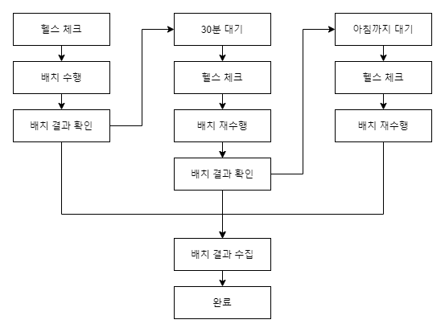

# 배치 작성 가이드

이 문서에서는 DataLake 수집기의 배치 스크립트 작성 및 운영에 대해서 기술한다.

> 본 문서에서 사용된 SVG 파일들은 GitLab의 결함으로 GitLab 보여지지 않을 수 있다. Clone 후에 VSCode의 Preview로 SVG파일의 그림을 정상적으로 볼 수 있다.

많은 수의 DBMS와 테이블, OpenAPI의 수집은 아주 작은 실패의 확율에도 매일 반복하면 실패하는 경우가 발생한다. 
운영상의 필요에 의한 DBMS의 Shutdown 또한 배치가 수행되는 밤시간에 발생하는 경우가 많으며, 외부에서 운영되는 OpenAPI는 높은 확율로 메시지의 수집에 실패한다. 
이러한 부분적인 실패에 대비하여 배치는 실패한 테이블들에 대해서만 재시도할 수 있도록 하고 있으며, 모든 테이블의 수집에 성공하였는지 확인할 수 있다. 
이렇게 구성된 배치 파일은 Crontab등의 작업 스케줄러에 의해서 주기적으로 수행되어야 한다.

이러한 부분을 고려하여 아래의 흐름에 따라 각 단계별로 배치를 수행하여 대개의 경우 배치를 성공으로 완료할 수 있다.

각 단계별 구체적 진행 방식을 아래에 각각 별도의 단락으로 기술한다.

 

## 목차

* [임시 파일 삭제](#임시-파일-삭제)
* [헬스 체크](#헬스-체크)
* [배치 수행](#배치-수행)
* [배치 결과 확인](#배치-결과-확인)
* [실패한 배치 재수행](#실패한-배치-재수행)
* [배치 결과 수집](#배치-결과-수집)
* [수집 배치 예제](#수집-배치-예제)

 

## 임시 파일 삭제

`$DATALAKE_COLLECTOR/tmp/` 디렉토리들의 파일들은 수집/적재 결과의 검증을 위해 레코들 값들을 저장해 두고 있어 그 크기가 크다. 
디스크가 가득차는 상황을 피하기 위해서 배치 수행 전에 이 디렉토리의 모든 파일들을 제거한다. 
또, 수집기에 필요에 의해서 생성된 파일들이 있다면 디렉토리를 지정하여 생성하고 삭제할 수 있도록 구성한다.

 

## 헬스 체크

`healthcheck` 명령으로 수집/적재 배치의 수행 전에 가용 서버를 확인할 수 있다. 
헬스 체크는 이중화(다중화) 가능한 서버 자원에 모두에 대해서 접속 여부를 검사하여, 종류별로 접속에 성공한 첫번쨰 서버를 사용하여 설정 파일을 생성한다. 
입력 파일로는 `$DATALAKE_COLLECTOR/cfg/healthcheck.json`이 사용된다. 
종류별로 접속 가능한 서버가 1개 이상 있을 경우 `EXITCODE`가 `0`으로 반환되며, 설정 파일 `$DATALAKE_COLLECTOR/cfg/datalake.json`이 수정된다. 
헬스 체크가 불필요할 경우 설정 파일 `$DATALAKE_COLLECTOR/cfg/datalake.json`을 바로 작성하여 다음의 단계부터 진행한다.

> `$DATALAKE_COLLECTOR/cfg/healthcheck.sample.json`을 복제 후 수정하여 사용하는 것을 권장한다.

접속 체크에 사용되는 설정 파일의 속성들은 아래와 같다.

| 설정명 | 설명 |
|---|---|
| repository | Rule 데이터베이스 서버의 접속 정보 |
| namenode.newvalue | HDFS의 최상위 PATH의 URL |
| hive | Hive 서버의 접속 정보 |
| proxy | HTTP/HTTPS 프락시 서버의 접속 정보 |

 

## 배치 수행

`batchrun` 명령에 인자 `배치기준시간`와 `연계방식코드`, `연결관리번호`의 목록을 사용하여 배치를 수행할 수 있다. 
`연계방식코드`별로 별도의 서버에서 수행하여 병렬성을 높일 수 있다. 
`연계방식코드`로 구분하여 순차적으로 수행하여 선후관계를 명확히하여 실행되도록 처리하도록 구성할 수 있다. 
모든 요소의 수집/적재가 성공하면 `EXITCODE`가 `0`으로 반환된다.

> 배치는 테이블은 자동으로 생성하지만 데이터베이스는 생성하지 않는다. 수행에 앞서 Hive에서 데이터베이스를 생성해 두어야 한다. 
> 설정 파일 `datalake.json`의 `threads` 값을 조정하여 처리 성능을 최적화할 수 있다.

 

## 배치 결과 확인

`batchcheck` 명령에 인자 `배치기준시간`와 `연결관리번호`의 목록을 사용하여 수집/적재의 성공 여부를 판단할 수 있다. 
배치 수행이 실패하였더라도 특정 `연결관리번호`의 성공만으로 처리할 수 있는 후처리의 수행에 앞서 확인을 위해서 사용한다.

 

## 실패한 배치 재수행

배치가 실패한 경우 동일한 명령으로 다시 `배치 수행`을 실행하면, 이미 수집/적재가 성공한 항목을 제외한 항목에 대해서만 수집/적재가 다시 수행된다. 
일시적인 장애 요인이 있을 경우 `배치 수행`이 성공할 때까지 지속적으로 반복 수행하여 효율적으로 배치를 성공할 수 있다. 
하지만, 테이블 구조의 변경과 같은 영구적인 오류 요인이 있을 경우는 `배치 수행`이 결코 성공할 수 없다. 
가능한 범위 내에서 적절할 횟수를 재수행한 후에도 지속적으로 실패할 경우 오류 로그를 분석하여 대처하여야 한다. 
오류의 확인에 필요한 테이블의 목록은 아래와 같다.

| 테이블영문명 | 테이블한글명 | 설명 |
|---|---|---|
| T_BATCH_STATUS_0001 | 배치수행상태정보  | |
| T_BATCH_LOG_0001 | 수집대상연결별배치로그 | |
| T_BATCH_LOG_0002 | DB테이블별배치로그 | |

> 재수행 과정에서의 결과와 로그를 반복하여 기록하여 재수행이 사유를 파악할 수 있다.

 

## 배치 결과 수집

`batchresult` 명령에 `배치기준시간`와 `연결관리번호`을 사용하여 배치 결과를 수집할 수 있다. 
위에서 언급된 테이블들의 로그와는 달리 실패에 의한 재시도가 있었다 하더라도 최종 결과만을 정리하여 테이블에 기록한다. 
수집 결과가 저장되는 테이블의 목록은 아래와 같다.

| 테이블영문명 | 테이블한글명 | 설명 |
|---|---|---|
| T_BATCH_DATE_0001 | 최종배치수행일시정보 | |
| T_BATCH_RESULT_0001 | 연계방식별배치결과| |
| T_BATCH_RESULT_0002 | 수집대상연결별배치결과 | |
| T_BATCH_RESULT_0003 | DB테이블별배치결과 | |

> 상황판(GUI)에서 배치 결과를 출력하기 위해서 사용한다.

 

## 수집 배치 예제

다음의 흐름에 따라 수행하는 배치 예제를 아래에 첨부한다.

* 오늘 날짜의 배치를 수행
* 실패 시 30분 대기 후 배치를 재수행
* 실패 시 오전 10시까지 대기 후 배치를 재수행
* 각 연결관리번호의 수집/적재가 성공하였을 경우 수행할 후속 절차 수행
* 배치 수집 결과를 정리

> 매 배치 수행 전 헬스 체크 수행으로 가동중인 서버 중 접속할 서버를 선택

~~~bash
#!/bin/bash

# 환경 구성
export DATALAKE_COLLECTOR="$HOME/work/datalake-collector"
export JAVA_HOME=/usr/lib/jvm/java-1.8.0-openjdk
PATH="$DATALAKE_COLLECTOR"/bin:/data/hive/bin:/data/hadoop/bin:"$JAVA_HOME"/bin:$PATH
umask 022

# 배치수행일자
BATCHDATE="date +%Y%m%d000000"
if [ "$1" ]; then
    BATCHDATE="$1"
fi

LIST="연결관리번호1 연결관리번호2"

cd "$DATALAKE_COLLECTOR"

# 임시 파일 삭제

rm -f "$DATALAKE_COLLECTOR/tmp/*"

# 헬스 체크 수행
"$DATALAKE_COLLECTOR/bin/healthcheck"
if [ "$?" -ne 0 ]; then
    echo "배치를 수행에 필요한 자원이 없음"
    exit 1
fi

# 수집 적제 1차 시도
"$DATALAKE_COLLECTOR/bin/batchrun" "$BATCHDATE" "01" $LIST
EXITCODE="$?"

# 실패 시 30분 대기 후 2차 시도
if [ "$EXITCODE" -ne 0 ]; then
    sleep 1
    "$DATALAKE_COLLECTOR/bin/healthcheck"
    if [ "$?" -ne 0 ]; then
        echo "배치를 수행에 필요한 자원이 없음"
        exit 1
    fi
    "$DATALAKE_COLLECTOR/bin/batchrun" "$BATCHDATE" "01" $LIST
    EXITCODE="$?"    
fi

# 실패 시 오전 10시까지 대기 후 3차 시도
if [ "$EXITCODE" -ne 0 ]; then 
    while true; do
        if [ `date +%H%M` -ge 1000 ]; then
            break;
        fi
        sleep 10
    done
    "$DATALAKE_COLLECTOR/bin/healthcheck"
    if [ "$?" -ne 0 ]; then
        echo "배치를 수행에 필요한 자원이 없음"
        exit 1
    fi
    "$DATALAKE_COLLECTOR/bin/batchrun" "$BATCHDATE" "01" $LIST
    EXITCODE="$?"    
fi

# 특정 시스템 성공 시 후처리 수행
"$DATALAKE_COLLECTOR/bin/batchcheck" "$BATCHDATE" "연결관리번호1"
if [ "$?" -eq 0 ]; then
    echo '"연결관리번호1"의 처리 성공 후 진행할 수 있는 후처리 수행 코드 작성'
fi
"$DATALAKE_COLLECTOR/bin/batchcheck" "$BATCHDATE" "연결관리번호2"
if [ "$?" -eq 0 ]; then
    echo '"연결관리번호2"의 처리 성공 후 진행할 수 있는 후처리 수행 코드 작성'
fi

# 배치 수행 결과를 정리
"$DATALAKE_COLLECTOR/bin/batchresult" "$BATCHDATE" "01"

exit "$EXITCODE"
~~~
