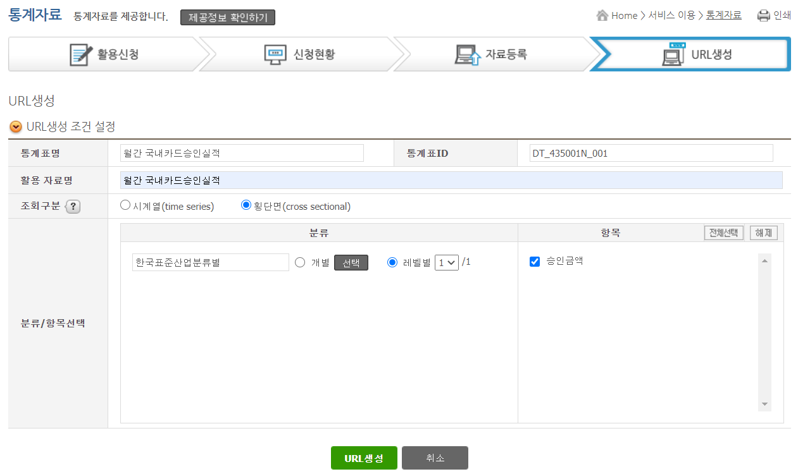

# Open API 가이드

이 문서에서는 Open API 작성 및 수행 가이드에 대해서 기술한다.

<br>

## 목차

* [Rule 구성](#Rule-구성)
* [수집기 작성](#수집기-작성)
* [OpenAPI 수행](#OpenAPI-수행)

<br>

## Rule 구성

본 단원에서는 Rule 구성 및 설정파일 생성 절차를 기술한다.

각 명령어에 대한 자세한 설명은 "[RULE.md](RULE.md) - Rule 데이터베이스 관리"를 참고한다.

* `createcfg` 명령어로 새로운 연결관리번호의 설정파일을 생성한다. 스키마명 인자는 선택적 인자이다. 명령어는 아래와 같다.

  ```sh
  createcfg {연결관리번호} {수집유형코드} {DBMS유형} {서버IP} {서버포트} {사용자ID} {비밀번호} {서비스명} {HIVE데이터베이스명} [스키마명]
  
  # 예시
  $ createcfg template1 00 SQLite3 "" "" "" "" ":memory:" st_api_001
  $ createcfg template2 00 SQLite3 "" "" "" "" ":memory:" st_api_002
  $ createcfg template3 00 SQLite3 "" "" "" "" ":memory:" st_api_003
  ```

  > Hive의 데이터베이스는 미리 생성해 두어야 한다.

* `buildrule` 명령어로 연결관리번호의 새로운 Rule 파일을 생성한다. 명령어는 아래와 같다.

  ```sh
  $ buildrule template1
  Rule 생성 성공: template1
  $ buildrule template2
  Rule 생성 성공: template2
  $ buildrule template3
  Rule 생성 성공: template3
  ```

  위 명령어를 실행하면 `cfg/IM-연결관리번호` 아래 각 연결관리번호에 해당되는 Rule 파일들이 3개씩 생성된다.

* Rule 파일을 작성한다. Rule 파일에 대한 설명은 "[README.md](../README.md) - 데이터베이스 구성"을 참조하길 바란다.<br>

  Rule 파일에 대한 예시는 아래 파일들과 같다.
  * [t_rule_meta_0001.csv](dat/t_rule_meta_0001.csv)
  * [t_rule_meta_0002.csv](dat/t_rule_meta_0002.csv)
  * [t_rule_meta_0003.csv](dat/t_rule_meta_0003.csv)

  csv파일을 열어보면 각 연결관리번호(template1, template2, template3)별로 작성되어져 있다. 위의 csv파일 내 각 연결관리번호에 맞는 레코드들을 `cfg/IM-연결관리번호` 아래 생성된 Rule 파일에 복사해서 넣어준다.<br>
  
  예를 들어 t_rule_meta_0001.csv에 있는 template1에 해당하는 레코드는 아래와 같다.<br>

  `template1,공공포털시스템_해양수산부_바닷가관리정보,02,"외부 정형 데이터",06,PostgreSQL,,st_api_001,hadoop,127.0.0.1,5432,,,hadoop,,,,,,,,{"serviceKey":"ceLKZ34NoTuwf0WwEvVTAeO3QDYWw+WVch+ZYwACCCs2uWktoNMndaw+4YawgjRlhpz/Z0/I4xsK/O9ts2Rkww=="},http://apis.data.go.kr/1192000/beachInfoService,02,DMZ,01,적용,,,,`<br>

  이 레코드를 `cfg/IM-template1` 아래 생성된 rule_meta_0001 파일에 넣어주면 된다.

* `updaterule` 명령어로 연결관리번호의 새롭게 작성된 파일을 Rule 데이터베이스에 반영한다. 명령어는 아래와 같다.

  ```sh
  $ updaterule template1
  Rule 수정 성공: template1
  $ updaterule template2
  Rule 수정 성공: template2
  $ updaterule template3
  Rule 수정 성공: template3
  ```

* `buildcfg` 명령어로 연결관리번호의 새로운 설정파일을 생성한다. 명령어는 아래와 같다.

  ```sh
  $ buildcfg template1
  설정 파일 생성 성공: public.getbeachlocationlist
  $ buildcfg template2
  설정 파일 생성 성공: public.DT_435001N_001
  $ buildcfg template3
  설정 파일 생성 성공: public.Incheon_West_Restaurant
  ```

<br>


## 수집기 작성

본 단원에서는 수집기 작성 가이드를 3가지 케이스로 나눠서 기술한다.<br>

각 OPENAPI 수집기에서 사용한 API에 대한 링크와 설명이 아래에 기술되어 있으나, 각 수집기에 대한 인증키는 위에서 작성했던 Rule 파일에 있으니, 아래 template 파일들로 테스트 시에 API 사이트에서 새로 인증키를 받을 필요는 없다.

수집기 작성 시 각 수집기 python파일의 이름은 반드시 각 `연결관리번호.py`로 해야 한다.
배치 수행 시 각 연결관리번호로 수집기를 호출하기 때문이다.

<br>

### template1

template1은 날짜별 조건 없이 데이터를 수집하는 케이스이다.

#### 데이터

데이터는 공공데이터포털의 "바닷가관리정보"에서 "소재지별 바닷가 목록 조회(getBeachLocationList)" 오퍼레이션을 사용했다.

https://www.data.go.kr/data/3056344/openapi.do 에서 관련된 정보들을 참조할 수 있고, api를 사용하기 위해서는 로그인 한 후 활용신청을 하면 된다.

<br>


#### 코드

API 수집기 파일 이름은 반드시 template1.py로 해주어야 한다.<br>

API 수집기를 실행하는 명령어는 아래와 같다.

```sh
python3 {python파일} {배치기준시간} {연결관리번호} [테이블명] ...
```

> 테이블이 없는 경우는 자동으로 생성하지만, 데이터베이스가 없는 경우는 자동으로 생성하지 않는다.<br>
> Hive의 데이터베이스는 미리 생성해 두어야 한다.

API 수집기가 실행되면 위 명령어의 인자들과 API 수집기 내의 handler를 파라미터로 받아 openapi.py가 실행되기 때문에 handler를 잘 작성해 주어야 한다. handler의 형식은 아래와 같다.

```python
handlers = {
    "시스템명": {
        "테이블명": {"handler": 수집기 함수명, "opaque": {"동적요청변수": "기본값"}}
    }
}

# 예시
handlers = {
    "template1": {
        "getBeachLocationList": {"handler": getBeachLocationList, "opaque": {"pubAsAddress": "신평면 부수리"}}
    }
}
```

openapi.py에서는 DB를 연결하고, 파라미터로 받은 handler를 통해 [Rule 구성](#Rule-구성)에서 생성한 설정파일에서 수집할 시스템의 Rule 메타 정보들을 가져온 후 API 수집기를 호출한다.

API 수집기는 API URL을 생성하여 데이터를 가져와 배열로 만든 contents를 리턴한다.

openapi.py에서는 API 수집기에서 return된 contents를 hive에 적재한다.<br>

API 수집기에 대한 코드는 아래와 같다.

```python
#!/usr/bin/python3
# -*- coding: utf-8 -*-

import json
import os
import sys
import urllib.parse

import openapi


def getBeachLocationList(jdbc, hive, conf, batch_date, cnnc_manage_no, table_eng_nm, opaque):

    # 수집 데이터 저장 변수
    contents = []

    # OPENAPI 데이터 수집 URL 및 Query Parameter
    baseurl = "{0}/{1}".format(
        cnnc_manage_no["API_DATA_URL"], "getBeachLocationList")
    # params에는 고정값의 요청변수를 적어준다.
    params = {
        "_type": "json",
        "numOfRows": 5,
        "pageNo": 1
    }
    # 인증키를 추가
    params.update(json.loads(cnnc_manage_no["API_DATA_AUTHKEY_NM"]))
    params.update(opaque)

    # OPENAPI 페이지별 수집 루프
    maxPages = 1
    while params["pageNo"] <= maxPages:
        # OPENAPI 호출
        url = "{0}?{1}".format(baseurl, urllib.parse.urlencode(
            params, quote_via=urllib.parse.quote))
        response = openapi.request(url, {"response": {"body": {
                                   "pageNo": None, "totalCount": None, "items": {"item": None}}}}, json.loads)
        # 최대 페이지 수 계산
        params["pageNo"] = response["response"]["body"]["pageNo"]
        totalCount = response["response"]["body"]["totalCount"]
        maxPages = int(
            (totalCount + (params["numOfRows"] - 1)) / params["numOfRows"])
        # 수집 데이터 가공 및 수집
        items = []
        if isinstance(response["response"]["body"]["items"]["item"], list):
            items.extend(response["response"]["body"]["items"]["item"])
        elif isinstance(response["response"]["body"]["items"]["item"], dict):
            items.append(response["response"]["body"]["items"]["item"])
        # 레코드별로 가져오기
        for item in items:
            element = []
            # 컬럼별로 가져오기
            for column in table_eng_nm["COLUMNS"]:
                if column["DB_TABLE_ATRB_SN"] is not None:
                    if column["TABLE_ATRB_ENG_NM"] in item:
                        value = item[column["TABLE_ATRB_ENG_NM"]]
                        if isinstance(value, str):
                            value = value.strip()
                        element.append(value)
                    else:
                        element.append(None)
            contents.append(element)
        print(".", end="", file=sys.stdout, flush=True)
        params["pageNo"] = params["pageNo"] + 1
    print("", file=sys.stdout, flush=True)

    return contents


handlers = {
    "template1": {
        "getBeachLocationList": {"handler": getBeachLocationList, "opaque": {"pubAsAddress": "신평면 부수리"}}
    }
}


if __name__ == "__main__":
    openapi.main(handlers)
```

<br>


### template2

template2는 월 별로 데이터를 수집하는 케이스이다.

#### 데이터

데이터는 국가통계포털의 "월간국내카드승인실적"을 사용하였다.

https://kosis.kr/openapi/index/index.jsp 에서 로그인을 하고 "서비스이용 - 통계자료"에서 api 활용신청을 해야 api를 볼 수 있다.

URL 생성 조건 설정은 아래와 같다.



URL 생성을 한 후, 기간설정을 선택하고 URL보기를 누르면 URL이 아래와 같이 생성된다.


<br>


#### 코드

API 수집기 파일 이름은 반드시 template2.py로 해주어야 한다.<br>

API 수집기를 실행하는 명령어는 "template1"과 동일하다.

API 수집기가 실행되면 명령어의 인자들과 API 수집기 내의 handler를 파라미터로 받아 openapi.py가 실행되기 때문에 handler를 잘 작성해 주어야 한다. handler의 형식은 "template1"과 동일하다.

openapi.py에서는 DB를 연결하고, 파라미터로 받은 handler를 통해 [Rule 구성](#Rule-구성)에서 생성한 설정파일에서 수집할 시스템의 Rule 메타 정보들을 가져온 후 API 수집기를 호출한다.

API 수집기는 API URL을 생성하여 데이터를 가져와 만든 contents 배열을 바로 hive에 적재한다. contents를 리턴하지 않고 바로 hive에 적재하는 이유는 연도별 파티션을 생성하여 레코드를 적재해야 하기 때문이다.<br>

API 수집기에 대한 코드는 아래와 같다.

```python
#!/usr/bin/python3
# -*- coding: utf-8 -*-

import json
import os
import sys
import urllib.parse

import openapi

min_partitions = 2
max_partitions = 10


# 데이터 json 변환 및 오류 판별
def convert(response):
    value = response
    if value.startswith("{err:"):
        if not value.startswith("{err:\"30\""):
            raise Exception("오류 메시지: {0}".format(value))
    else:
        value = json.loads(value)
    return value


def collect_DT_435001N_001(jdbc, hive, conf, batch_date, cnnc_manage_no, table_eng_nm, opaque):

    # OPENAPI 데이터 수집 URL 및 Query Parameter
    baseurl = "{0}".format(cnnc_manage_no["API_DATA_URL"])
    # params에는 고정값의 요청변수를 적어준다.
    params = {
        "method": "getList",
        "format": "json",
        "jsonVD": "Y",
        "prdSe": "M"
    }
    # 인증키를 추가
    params.update(json.loads(cnnc_manage_no["API_DATA_AUTHKEY_NM"]))
    params.update(opaque)

    # 파티션 목록 가져오기
    partitions = openapi.get_partitions(hive, cnnc_manage_no, table_eng_nm)

    # 배치기준일시에서 연도 추출
    last_year = int(batch_date[0:4])

    # OPENAPI 연도별 수집 루프
    for year in range(last_year - max_partitions, last_year + 1):
        contents = []
        partition = "{0:04d}0000000000".format(year)
        # 파티션 유무에 따른 수집 여부 결정, 최근 데이터는 무조건 수집 혹은 재수집
        if last_year - year >= min_partitions and partition in partitions:
            print("파티션이 있음: {0}".format(partition),
                  file=sys.stderr, flush=True)
            continue
        # 월별 수집 루프
        for month in range(1, 13):
            yyyymm = "{0:04d}{1:02d}".format(year, month)
            params["startPrdDe"] = yyyymm
            params["endPrdDe"] = yyyymm

            # OPENAPI 호출
            url = "{0}?{1}".format(baseurl, urllib.parse.urlencode(
                params, quote_via=urllib.parse.quote))
            response = openapi.request(url, convert=convert)

            # 결과값이 string 형이면 데이터가 없음
            if isinstance(response, str):
                print("데이터가 없음: {0}년 {1}월".format(
                    year, month), file=sys.stderr, flush=True)
                continue

            # 수집 데이터 가공 및 수집
            items = []
            if isinstance(response, list):
                items.extend(response)
            elif isinstance(response, dict):
                items.append(response)
            # 레코드별로 가져오기
            for item in items:
                element = []
                # 컬럼별로 가져오기
                for column in table_eng_nm["COLUMNS"]:
                    if column["DB_TABLE_ATRB_SN"] is not None:
                        if column["TABLE_ATRB_ENG_NM"] in item:
                            value = item[column["TABLE_ATRB_ENG_NM"]]
                            if isinstance(value, str):
                                value = value.strip()
                            # Hive 데이터형이 INTERGER인 컬럼은 int로 변환
                            if column["HIVE_ATRB_TY_NM"] == "INTEGER":
                                value = int(value)
                            element.append(value)
                        else:
                            element.append(None)
                contents.append(element)
            print(".", end="", file=sys.stdout, flush=True)

        # Hive에 연도별 파티션 생성 후 레코드 적재
        if openapi.hivestore(jdbc, hive, conf, batch_date, cnnc_manage_no, contents, table_eng_nm, partition=partition) != 0:
            print("파티션 저장 실패: {0}".format(partition),
                  file=sys.stderr, flush=True)

    print("", file=sys.stdout, flush=True)


handlers = {
    "template2": {
        "DT_435001N_001": {"handler": collect_DT_435001N_001, "opaque": {"startPrdDe": "", "endPrdDe": ""}}
    }
}


if __name__ == "__main__":
    openapi.main(handlers)
```

<br>


### template3

template3는 csv파일을 수집하는 케이스이다.

#### 데이터

데이터는 공공데이터포털의 "인천광역시 서구_맛집"의 csv 파일을 사용했다.

https://www.data.go.kr/data/15063504/fileData.do 에서 관련된 정보들을 참조할 수 있고, csv를 다운받기 위해서는 해당 링크에 들어가서 다운로드를 누르면 된다.

<br>


#### 코드

API 수집기 파일 이름은 반드시 template3.py로 해주어야 한다.<br>

API 수집기를 실행하는 명령어는 "template1"과 동일하다.

API 수집기가 실행되면 명령어의 인자들과 API 수집기 내의 handler를 파라미터로 받아 openapi.py가 실행되기 때문에 handler를 잘 작성해 주어야 한다. handler의 형식은 "template1"과 동일하다.

openapi.py에서는 DB를 연결하고, 파라미터로 받은 handler를 통해 [Rule 구성](#Rule-구성)에서 생성한 설정파일에서 수집할 시스템의 Rule 메타 정보들을 가져온 후 API 수집기를 호출한다.

API 수집기는 csv파일을 읽어서 데이터를 가져와 배열로 만든 contents를 리턴한다.

openapi.py에서는 API 수집기에서 return된 contents를 hive에 적재한다.<br>

API 수집기에 대한 코드는 아래와 같다.

```python
#!/usr/bin/python3
# -*- coding: utf-8 -*-

import csv
import datetime
import os
import sys

import openapi


def getList(jdbc, hive, conf, batch_date, cnnc_manage_no, table_eng_nm, opaque):

    # 수집 데이터 저장 변수
    contents = []

    filename = os.path.join(
        os.environ["DATALAKE_COLLECTOR"], "doc/dat/sample.csv")
    file = open(filename, "rt", encoding="euc-kr")
    reader = csv.reader(file)

    # 파일 데이터 가공 및 수집
    for record in reader:
        element = []
        for column in table_eng_nm["COLUMNS"]:
            if column["DB_TABLE_ATRB_SN"] is not None:
                value = record.pop(0)
                if isinstance(value, str):
                    value = value.strip()
                if column["HIVE_ATRB_TY_NM"] == "DECIMAL":
                    value = float(value)
                if column["HIVE_ATRB_TY_NM"] == "DATE":
                    value = datetime.datetime.strptime(
                        value, "%Y-%m-%d").date()
                element.append(value)
        contents.append(element)

    return contents


handlers = {
    "template3": {
        "Incheon_West_Restaurant": {"handler": getList, "opaque": ""}
    }
}


if __name__ == "__main__":
    openapi.main(handlers)
```

<br>


## OpenAPI 수행

본 단원에서는 OpenAPI 수행 방법을 기술한다.<br>

OpenAPI 수행 방법에는 개별수행과 배치수행이 있다. 자세한 설명은 아래와 같다.

<br>

### 개별수행

API 수집기 하나씩 수행하는 방법이다. 테이블명 인자는 여러개일 경우 뒤로 나열하면 된다. 테이블명 인자를 넣지 않으면 연결관리번호에 해당하는 모든 테이블을 수집한다.<br>

API 수집기를 실행하는 명령어는 아래와 같다.

```sh
python3 {python파일} {배치기준시간} {연결관리번호} [테이블명] ...

# 예시
python3 template1.py 20200101000000 template1 getBeachLocationList
```

> 테이블이 없는 경우는 자동으로 생성하지만, 데이터베이스가 없는 경우는 자동으로 생성하지 않는다.<br>
> Hive의 데이터베이스는 미리 생성해 두어야 한다.

<br>


### 배치수행

각 API 수집기들을 배치로 묶어서 수행하는 방법이다. 연결관리번호 인자는 여러개일 경우 뒤로 나열하면 된다.<br>

배치수행하는 `batchrun` 명령어 사용법은 아래와 같다.

```sh
batchrun {배치기준시간} {연계방식코드} {연결관리번호} ...

# 예시
batchrun 20200101000000 02 template1 template2 template3 ...
```

> 테이블이 없는 경우는 자동으로 생성하지만, 데이터베이스가 없는 경우는 자동으로 생성하지 않는다.<br>
> Hive의 데이터베이스는 미리 생성해 두어야 한다.
