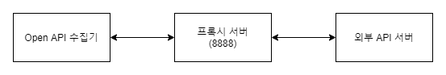

# Proxy 서버 구축 가이드

이 문서에서는 내부망의 OpenAPI에서 외부망의 API 서버로 접근하기 위한 Proxy 서버 구축에 대해서 기술한다.

> 본 문서에서 사용된 SVG 파일들은 GitLab의 결함으로 GitLab 보여지지 않을 수 있다. Clone 후에 VSCode의 Preview로 SVG파일의 그림을 정상적으로 볼 수 있다.

아래에 구축할 Proxy서버의 Hop 수로 나눠서 기술한다.

<br>

## 목차

* [단일 Hop Proxy 서버](#단일-Hop-Proxy-서버)
* [다중 Hop Proxy 서버](#다중-Hop-Proxy-서버)

<br>

## 단일 Hop Proxy 서버

본 단원에서는 단일 프록시 서버의 구축 방법을 기술한다.<br>

프록시 서버의 포트번호는 8888로 설정해 주었다.



`프록시 서버(8888)`의 `httpd.conf` 파일의 아래의 항목들을 수정하여 `Apache HTTPD`를 `Proxy Server`로 운영할 수 있다.

```sh
# Listen 80을 8888 포트로 바꾸어준다.
Listen 8888

...(생략)...

# 아래의 3가지 모듈의 주석을 풀어준다.
LoadModule proxy_module modules/mod_proxy.so
LoadModule proxy_connect_module modules/mod_proxy_connect.so
LoadModule proxy_http_module modules/mod_proxy_http.so

...(생략)...

# forwarding proxy server 설정을 아래 추가해준다.
ProxyRequests On
ProxyVia On

<Proxy *>
Order deny,allow
Deny from all
Allow from 172.17.0.1
</Proxy>
```

> `Allow from`의 뒤에는 접속하고자 하는 장비의 IP를 나열한다.<br>

프록시 서버를 경유한 요청의 확인은 프록시 서버의 `access_log`를 조회할 수 있다.

<br>


## 다중 Hop Proxy 서버

본 단원에서는 다중 프록시 서버의 구축 방법을 기술한다.<br>


`외측 프록시 서버(8888)`의 설정은 위의 `단일 Hop Proxy 서버`의 설정과 동일하다.<br>
`내측 프록시 서버(8080)`의 `httpd.conf` 파일의 아래의 항목들을 수정하여 `Apache HTTPD`를 `Relay 방식`의 `Proxy Server`로 운영할 수 있다.

```sh
# Listen 80을 8080 포트로 바꾸어준다.
Listen 8080

...(생략)...

# 아래의 3가지 모듈의 주석을 풀어준다.
LoadModule proxy_module modules/mod_proxy.so
LoadModule proxy_connect_module modules/mod_proxy_connect.so
LoadModule proxy_http_module modules/mod_proxy_http.so

...(생략)...

# forwarding proxy server 설정을 아래 추가해준다.
ProxyRequests On
ProxyVia On

# 현재 proxy에 대한 원격 proxy를 정의
ProxyRemote * http://프록시 서버2의 IP:8888

<Proxy *>
Order deny,allow
Deny from all
Allow from 172.17.0.1
</Proxy>
```

>  `내측 프록시 서버`의 수를 늘여 경유 Hop의 수를 늘일 수 있다.

프록시 서버를 경유한 요청의 확인은 각 프록시 서버의 `access_log`를 조회할 수 있다.
